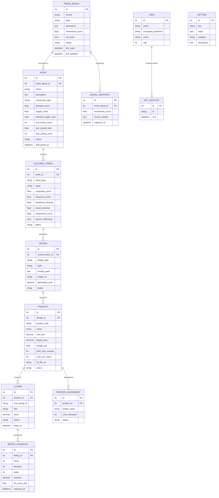
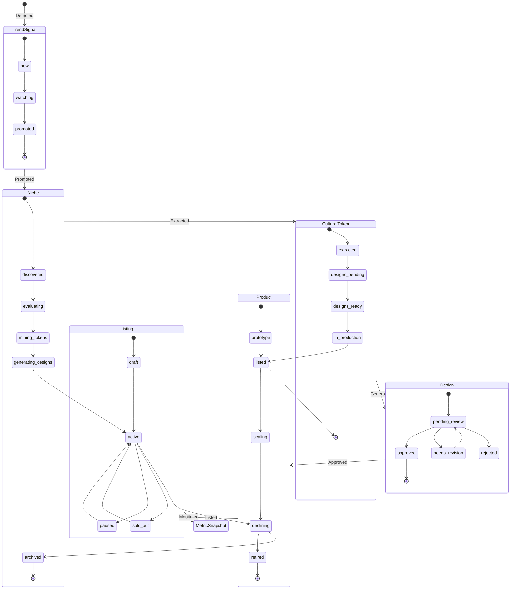

# Rails Models Reference

## Domain Model Overview

The TrendMines data model represents the product discovery pipeline from early signals to marketplace listings. Each model tracks a specific stage with status enums managing lifecycle transitions.



---

## TrendSignal

**File:** `app/models/trend_signal.rb`

Represents an early trend signal detected from external sources (AO3, Reddit, TikTok, Google Trends, etc.). Signals are monitored for momentum and promoted to niches when they show commercial potential.

### Attributes

- `source` (string, required) - Origin of the signal (e.g., 'twitter', 'reddit', 'google_trends')
- `topic` (string, required) - The trending topic or keyword
- `description` (text) - Additional context about the signal
- `momentum_score` (float) - Calculated momentum metric (0.0 - 1.0)
- `raw_data` (json) - Source-specific data blob for analysis
- `status` (string, required) - Current monitoring status
- `first_seen` (datetime) - When the signal was first detected
- `last_updated` (datetime) - Most recent update timestamp

### Status Lifecycle

```
new → watching → promoted → archived
```

**Enum Definition:**
```ruby
enum :status, {
  status_new: "new",         # Just detected, needs evaluation
  watching: "watching",       # Actively monitoring momentum
  promoted: "promoted",       # Converted to a niche
  archived: "archived"        # No longer tracking
}, prefix: true, default: :status_new
```

**Note:** Prefixed to avoid conflicts (use `.status_new`, `.status_watching`, etc.)

### Associations

- `has_many :niches` - Signals can be promoted to multiple niches over time
- `has_many :signal_snapshots` - Historical momentum snapshots

### Scopes

- `.by_momentum` - Sorted by momentum_score DESC
- `.active` - Signals with status 'new' or 'watching'

### Validations

- `source` must be present
- `topic` must be present
- `status` must be present

---

## Niche

**File:** `app/models/niche.rb`

Represents a market niche identified from trend signals. Niches are evaluated for commercial potential based on demand/supply metrics from AO3 (fanfiction) and Etsy (marketplace).

### Attributes

- `trend_signal_id` (integer, required, FK) - Parent trend signal
- `name` (string, required) - Name of the niche
- `description` (text) - Detailed description
- `community_type` (string) - Type of community (e.g., 'fandom', 'subculture', 'lifestyle')
- `demand_score` (float) - Calculated demand metric (0.0 - 10.0)
- `supply_score` (float) - Calculated supply metric (0.0 - 10.0)
- `demand_supply_ratio` (float) - Ratio of demand to supply (higher is better)
- `ao3_works_count` (integer) - Number of fanfiction works on AO3
- `ao3_growth_rate` (float) - Growth rate of AO3 works (percentage)
- `etsy_listing_count` (integer) - Number of similar listings on Etsy
- `status` (string, required) - Current pipeline status
- `discovered_at` (datetime) - When the niche was first identified

### Status Lifecycle

```
discovered → evaluating → mining_tokens → generating_designs → active → declining → archived
```

**Enum Definition:**
```ruby
enum :status, {
  discovered: "discovered",               # Just identified
  evaluating: "evaluating",               # Analyzing demand/supply
  mining_tokens: "mining_tokens",         # Extracting cultural tokens
  generating_designs: "generating_designs", # Creating designs
  active: "active",                        # Live in marketplace
  declining: "declining",                  # Performance dropping
  archived: "archived"                     # No longer pursuing
}, default: :discovered
```

### Associations

- `belongs_to :trend_signal` - Parent signal
- `has_many :cultural_tokens` - Extracted cultural elements

### Scopes

- `.by_demand_ratio` - Sorted by demand_supply_ratio DESC
- `.active_pipeline` - Niches not declining or archived

### Validations

- `name` must be present
- `status` must be present

### Key Metrics

**Demand Indicators:**
- `ao3_works_count` - Proxy for community engagement
- `ao3_growth_rate` - Trend momentum
- `demand_score` - Composite demand metric

**Supply Indicators:**
- `etsy_listing_count` - Competition level
- `supply_score` - Composite supply metric

**Decision Metric:**
- `demand_supply_ratio` - Primary ranking factor (demand / supply)

---

## CulturalToken

**File:** `app/models/cultural_token.rb`

Represents a cultural element extracted from a niche with design potential. Cultural tokens are key symbols, phrases, or concepts that resonate with a community and can be transformed into marketable designs.

### Attributes

- `niche_id` (integer, required, FK) - Parent niche
- `token_type` (string, required) - Type of token (e.g., 'phrase', 'symbol', 'character', 'meme')
- `value` (string, required) - The actual content of the token
- `composite_score` (float) - Overall viability score for design conversion (0.0 - 1.0)
- `frequency_score` (float) - How often it appears (0.0 - 1.0)
- `emotional_intensity` (float) - Sentiment strength (0.0 - 1.0)
- `visual_potential` (float) - Suitability for visual design (0.0 - 1.0)
- `uniqueness_score` (float) - Differentiation from competition (0.0 - 1.0)
- `source_references` (json) - Array of source URLs/data where token was found
- `status` (string, required) - Current production status

### Status Lifecycle

```
extracted → designs_pending → designs_ready → in_production → listed
```

**Enum Definition:**
```ruby
enum :status, {
  extracted: "extracted",             # Just identified
  designs_pending: "designs_pending", # Queued for design generation
  designs_ready: "designs_ready",     # Designs generated and approved
  in_production: "in_production",     # Being printed/manufactured
  listed: "listed"                    # Live on marketplace
}, default: :extracted
```

### Associations

- `belongs_to :niche` - Parent niche
- `has_many :designs` - Generated design concepts

### Scopes

- `.by_composite_score` - Sorted by composite_score DESC
- `.ready_for_designs` - Tokens with 'extracted' status

### Validations

- `token_type` must be present
- `value` must be present
- `status` must be present

### Scoring System

The `composite_score` is calculated from multiple dimensions:

1. **Frequency Score** - How often the token appears in community content
2. **Emotional Intensity** - Sentiment analysis of token context
3. **Visual Potential** - Suitability for translation to visual design
4. **Uniqueness Score** - Differentiation from existing marketplace offerings

**Formula:** Weighted average of the four component scores.

---

## Design

**File:** `app/models/design.rb`

Represents a design concept generated from a cultural token. Designs are AI-generated artwork that go through review and approval before being converted into physical products.

### Attributes

- `cultural_token_id` (integer, required, FK) - Parent cultural token
- `design_type` (string, required) - Type of design (e.g., 'graphic', 'pattern', 'illustration')
- `style` (string) - Visual style applied (e.g., 'minimalist', 'vintage', 'kawaii')
- `prompt_used` (text) - AI generation prompt used
- `image_url` (string) - URL to the generated design image
- `generation_cost` (decimal) - Cost tracking for AI generation (USD)
- `status` (string, required) - Current review status

### Status Lifecycle

```
pending_review → approved
                ↘ rejected
                ↘ needs_revision → pending_review
```

**Enum Definition:**
```ruby
enum :status, {
  pending_review: "pending_review",   # Awaiting human review
  approved: "approved",                # Ready for product creation
  rejected: "rejected",                # Not suitable
  needs_revision: "needs_revision"    # Needs regeneration with changes
}, default: :pending_review
```

### Associations

- `belongs_to :cultural_token` - Parent token
- `has_many :products` - Physical product variants

### Scopes

- `.pending` - Designs awaiting review
- `.approved` - Designs ready for product creation

### Validations

- `design_type` must be present
- `status` must be present

### Workflow

1. **Generation** - AI creates design from token and prompt
2. **Review** - Human evaluates quality and brand fit
3. **Approval/Rejection** - Decision determines next steps
4. **Revision** - If needs work, regenerate with updated prompt
5. **Production** - Approved designs become products

---

## Product

**File:** `app/models/product.rb`

Represents a physical print-on-demand product derived from a design. Products go through a lifecycle from prototype to listing on marketplaces, tracking production costs, pricing, and manufacturing assignments.

### Attributes

- `design_id` (integer, required, FK) - Parent design
- `product_type` (string, required) - Type of product (e.g., 'sticker', 'mug', 'poster', 't_shirt')
- `name` (string, required) - Display name for the product
- `unit_cost` (decimal) - Cost per unit in USD
- `target_price` (decimal) - Desired selling price in USD
- `margin_pct` (float) - Profit margin percentage
- `print_time_minutes` (integer) - Time required to produce one unit
- `units_per_batch` (integer) - Number of units producible in one batch
- `stl_file_url` (string) - URL to STL file for 3D printing (if applicable)
- `status` (string, required) - Current lifecycle status

### Status Lifecycle

```
prototype → listed → scaling → declining → retired
```

**Enum Definition:**
```ruby
enum :status, {
  prototype: "prototype",   # Testing/validation phase
  listed: "listed",         # Live on marketplace
  scaling: "scaling",       # Increasing production capacity
  declining: "declining",   # Performance dropping
  retired: "retired"        # No longer selling
}, default: :prototype
```

### Associations

- `belongs_to :design` - Parent design
- `has_many :listings` - Marketplace listings
- `has_many :printer_assignments` - Production allocations

### Scopes

- `.active` - Products with status 'listed' or 'scaling'

### Validations

- `product_type` must be present
- `name` must be present
- `status` must be present

### Economics

**Cost Structure:**
- `unit_cost` - Material + labor cost per unit
- `target_price` - Desired selling price
- `margin_pct` - Calculated as: `((target_price - unit_cost) / target_price) * 100`

**Example:**
```ruby
product = Product.new(
  unit_cost: 0.50,
  target_price: 3.99
)
# margin_pct = ((3.99 - 0.50) / 3.99) * 100 = 87.5%
```

---

## PrinterAssignment

**File:** `app/models/printer_assignment.rb`

Represents the allocation of 3D printers to specific products. Tracks which printers are assigned to produce which products and their allocated capacity.

### Attributes

- `product_id` (integer, required, FK) - Product being produced
- `printer_name` (string) - Identifier for the printer
- `units_allocated` (integer) - Number of units allocated to this printer
- `status` (string) - Assignment status

### Associations

- `belongs_to :product` - Product being manufactured

### Purpose

Tracks production capacity allocation across multiple printers. Used for:
- Production planning
- Capacity utilization
- Bottleneck identification

---

## Listing

**File:** `app/models/listing.rb`

Represents a marketplace listing for a product. Listings track the product's presence on platforms like Etsy, including title, pricing, and current status.

### Attributes

- `product_id` (integer, required, FK) - Product being listed
- `etsy_listing_id` (string) - External platform's listing identifier
- `title` (string, required) - Public listing title
- `price` (decimal) - Current listing price in USD
- `status` (string, required) - Current listing status
- `listed_at` (datetime) - When the listing went live

### Status Lifecycle

```
draft → active → sold_out
             ↘ paused
```

**Enum Definition:**
```ruby
enum :status, {
  draft: "draft",         # Not yet published
  active: "active",       # Live on marketplace
  sold_out: "sold_out",   # Temporarily out of stock
  paused: "paused"        # Temporarily disabled
}, default: :draft
```

### Associations

- `belongs_to :product` - Parent product
- `has_many :metric_snapshots` - Performance data

### Scopes

- `.active` - Listings with 'active' status
- `.with_metrics` - Listings that have metric snapshots

### Validations

- `title` must be present
- `status` must be present

### Multi-Marketplace Support

**Current:** Etsy-focused (`etsy_listing_id`)
**Future:** Expand to Amazon, Redbubble, etc. with polymorphic `platform` field

---

## MetricSnapshot

**File:** `app/models/metric_snapshot.rb`

Represents a time-series snapshot of listing performance metrics. Captured at regular intervals to track trends and detect decay.

### Attributes

- `listing_id` (integer, required, FK) - Listing being tracked
- `views` (integer) - Number of views
- `favorites` (integer) - Number of favorites/likes
- `sales` (integer) - Number of units sold
- `revenue` (decimal) - Total revenue in USD
- `fav_view_ratio` (float) - Favorites divided by views (conversion indicator)
- `captured_at` (datetime) - When the snapshot was taken

### Associations

- `belongs_to :listing` - Parent listing

### Purpose

Powers analytics features:
- **Alerts** - Detect performance drops
- **Leaderboards** - Rank top performers
- **Decay Detection** - Identify declining listings
- **Trend Analysis** - Visualize performance over time

### Key Metrics

**Engagement:**
- `views` - Traffic indicator
- `favorites` - Interest indicator
- `fav_view_ratio` - Conversion rate proxy (higher is better)

**Revenue:**
- `sales` - Units sold
- `revenue` - Dollar amount

**Example Query:**
```ruby
# Get listing metrics over the last 30 days
listing.metric_snapshots
  .where('captured_at >= ?', 30.days.ago)
  .order(captured_at: :asc)
```

---

## SignalSnapshot

**File:** `app/models/signal_snapshot.rb`

Represents a point-in-time snapshot of trend signal momentum. Snapshots are captured periodically to track momentum velocity and source metrics over time, powering sparkline charts in the Signal Radar.

### Attributes

- `trend_signal_id` (integer, required, FK) - Parent trend signal
- `momentum_score` (float) - Momentum velocity at capture time
- `source_metrics` (json) - Platform-specific metrics at capture time
- `captured_at` (datetime, required) - When this snapshot was captured

### Associations

- `belongs_to :trend_signal` - Parent signal

### Scopes

- `.recent` - Sorted by captured_at DESC
- `.for_period(start_date, end_date)` - Snapshots within date range

---

## Setting

**File:** `app/models/setting.rb`

Stores application configuration values for scanning, scoring, alerts, templates, and integrations. API keys are managed via Rails credentials, not this table.

### Attributes

- `key` (string, required, unique) - Dot-notation key (e.g., "scanning.ao3_frequency")
- `value` (json) - JSON value (numbers, strings, objects)
- `category` (string, required) - Grouping category
- `description` (text) - Human-readable explanation

### Categories

`scanning`, `scoring`, `alerts`, `templates`, `integrations`

### Associations

None (standalone configuration store)

### Scopes

- `.by_category(cat)` - Filter by category

### Class Methods

- `.grouped_by_category` - Returns settings grouped by category as a hash

### Validations

- `key` must be present and unique
- `category` must be present and in CATEGORIES
- Value validation varies by category (positive integers for scanning, weights 1-10 for scoring, etc.)

---

## User

**File:** `app/models/user.rb`

Represents a user account for dashboard access. Managed by Devise with JWT authentication.

### Attributes

- `email` (string, required, unique) - User email address
- `encrypted_password` (string, required) - Bcrypt hashed password
- `name` (string, required) - Display name
- `role` (integer, required, default: 0) - User role enum
- `remember_created_at` (datetime) - Remember me token timestamp
- `reset_password_token` (string) - Password reset token
- `reset_password_sent_at` (datetime) - Token sent timestamp

### Role Enum

```ruby
enum :role, {
  operator: 0,  # Standard operator
  admin: 1      # Full access
}, default: :operator
```

### Devise Modules

- **Database Authenticatable** - Password authentication
- **Registerable** - User registration
- **Recoverable** - Password reset
- **Rememberable** - Remember me cookie
- **Validatable** - Email and password validation

### JWT Strategy

Configured with `devise-jwt` gem:
- Tokens stored in `Authorization` header
- Revocation via `JwtDenylist` model
- Automatic token refresh

---

## JwtDenylist

**File:** `app/models/jwt_denylist.rb`

Represents revoked JWT tokens. Used for logout functionality.

### Attributes

- `jti` (string, required, unique) - JWT ID (unique token identifier)
- `exp` (datetime, required) - Token expiration timestamp

### Purpose

When a user logs out, their JWT is added to the denylist. Future requests with that token will be rejected even if the token hasn't expired yet.

### Devise Integration

Configured as the revocation strategy for `devise-jwt`:
```ruby
config.jwt do |jwt|
  jwt.revocation_strategy = JwtDenylist
end
```

---

## Common Model Patterns

### Status Enums

All major resources use Rails enums for status tracking:
```ruby
enum :status, {
  state_one: "state_one",
  state_two: "state_two"
}, default: :state_one
```

This provides:
- Database validation
- Scopes (`.state_one`, `.state_two`)
- Predicates (`.state_one?`, `.state_two?`)
- Bang methods (`.state_one!`, `.state_two!`)
- Prefix support for avoiding conflicts

### Scopes

Models define reusable query scopes:
```ruby
scope :active, -> { where(status: [:listed, :scaling]) }
scope :by_score, -> { order(composite_score: :desc) }
```

### Associations

Clear parent-child relationships with proper foreign keys and `dependent:` options:
- `dependent: :destroy` - Delete children when parent deleted
- `dependent: :nullify` - Set foreign key to NULL

### Validations

Standard Rails validations:
- `presence: true` - Required fields
- `uniqueness: true` - Unique constraints

---

## Model Lifecycle Summary



---

## Related Documentation

- [Architecture Overview](./architecture.md) - System design and data flow
- [API Reference](./api.md) - REST API endpoints
- [Etsy Integration](../integrations/etsy.md) - Marketplace integration
