# Etsy Integration

## Overview

TrendMines integrates with Etsy as its primary marketplace for listing print-on-demand products. The integration is designed to support automated listing creation, metric monitoring, and performance tracking.

**Current Status:** 🚧 Planned (not yet implemented)

This document describes the planned integration architecture and key touchpoints with the Etsy API.

---

## Etsy API

**API Version:** Etsy Open API v3
**Documentation:** https://developers.etsy.com/documentation/

### Authentication

Etsy uses **OAuth 2.0** for API authentication:

1. **App Registration** - Register app in Etsy Developer Portal
2. **OAuth Flow** - Redirect user to Etsy for authorization
3. **Access Tokens** - Store token for API requests
4. **Refresh Tokens** - Handle token expiration

**OAuth Scopes Needed:**
- `listings_r` - Read listings
- `listings_w` - Create/update listings
- `shops_r` - Read shop details
- `shops_w` - Update shop settings

### Rate Limits

- **Open API:** 10 requests/second per application
- **Burst limit:** 25 requests/second short bursts
- **Quota:** Additional limits based on subscription tier

**Strategy:** Implement request queuing and throttling to stay within limits.

---

## Data Flow

### Listing Creation Flow

```mermaid
flowchart TB
    P[Product] -->|Human Decision| LC[Listing Creator]
    LC -->|OAuth| ETSY[Etsy API]
    ETSY -->|listing_id| L[Listing Record]
    L -->|Store| DB[(Database)]
    DB -->|Track| MS[Metric Snapshots]

    style P fill:#f4a261
    style L fill:#e9c46a
    style ETSY fill:#e76f51
    style DB fill:#264653
```



1. **Product Ready** - Product status is 'prototype' and approved for listing
2. **Human Decision** - Operator decides to list on Etsy
3. **API Call** - Backend calls Etsy API to create listing
4. **Store Listing ID** - Save `etsy_listing_id` in `listings` table
5. **Monitor Metrics** - Begin periodic metric collection

### Metric Collection Flow

```mermaid
flowchart TB
    CRON[OpenClaw Cron Job] -->|Every 12hr| FETCH[Fetch Metrics]
    FETCH -->|OAuth| ETSY[Etsy API]
    ETSY -->|Stats| PARSE[Parse Data]
    PARSE -->|Create| MS[Metric Snapshot]
    MS -->|Analyze| ALERT[Alert Detection]
    ALERT -->|Notify| DASH[Dashboard]

    style CRON fill:#2d6a4f
    style ETSY fill:#e76f51
    style MS fill:#264653
    style DASH fill:#1a1a2e
```



1. **Scheduled Job** - OpenClaw runs every 12 hours
2. **Bulk Fetch** - Get metrics for all active listings
3. **Create Snapshots** - Store in `metric_snapshots` table
4. **Detect Anomalies** - Check for decay or spikes
5. **Generate Alerts** - Notify operator of issues

---

## Integration Points

### 1. Listing Creation

**TrendMines Endpoint:** `POST /api/v1/products/:id/list`

**Etsy Endpoint:** `POST /v3/application/shops/{shop_id}/listings`

**Workflow:**
1. Operator clicks "List on Etsy" in dashboard
2. TrendMines API validates product readiness
3. Backend constructs Etsy listing payload
4. Calls Etsy API with OAuth token
5. Stores `etsy_listing_id` in database
6. Updates product status to 'listed'

**Payload Mapping:**

| TrendMines Field | Etsy Field | Notes |
|-----------------|-----------|-------|
| `product.name` | `title` | May need transformation for SEO |
| `product.target_price` | `price` | In shop's currency |
| `design.image_url` | `image` | Upload via separate endpoint |
| `cultural_token.value` | `tags` | Map to Etsy tags |
| `niche.description` | `description` | Formatted for marketplace |
| `product.product_type` | `taxonomy_id` | Map to Etsy category |

**Example Request:**
```json
POST /v3/application/shops/123456/listings
Authorization: Bearer <oauth_token>

{
  "quantity": 999,
  "title": "Cottagecore Aesthetic Sticker",
  "description": "Rustic, nature-inspired design...",
  "price": 3.99,
  "who_made": "i_did",
  "is_supply": false,
  "when_made": "made_to_order",
  "taxonomy_id": 1234,
  "tags": ["cottagecore", "aesthetic", "nature", "sticker"]
}
```

**Error Handling:**
- **Validation Errors** - Return to user for correction
- **Rate Limits** - Queue and retry with backoff
- **Auth Errors** - Redirect to OAuth flow

---

### 2. Image Upload

**Etsy Endpoint:** `POST /v3/application/shops/{shop_id}/listings/{listing_id}/images`

**Workflow:**
1. Download image from `design.image_url`
2. Upload to Etsy via multipart/form-data
3. Store Etsy `image_id` for future reference

**Considerations:**
- Max image size: 10MB
- Supported formats: JPEG, PNG, GIF
- Max 10 images per listing
- First image is the primary

---

### 3. Metric Collection

**TrendMines Endpoint:** `POST /api/v1/listings/:id/metrics`

**Etsy Endpoint:** `GET /v3/application/shops/{shop_id}/listings/{listing_id}`

**Metrics Available:**
- `views` - Total listing views
- `favorites` - Number of users who favorited
- `num_favorers` - Unique users (same as favorites)

**Note:** Sales and revenue data require Etsy "Stats" API with elevated permissions.

**Payload Mapping:**

| Etsy Field | TrendMines Field | Notes |
|-----------|----------------|-------|
| `views` | `views` | Direct mapping |
| `num_favorers` | `favorites` | Direct mapping |
| N/A | `sales` | Manual entry or Etsy Stats API |
| N/A | `revenue` | Calculated from sales |
| Calculated | `fav_view_ratio` | `favorites / views` |

**Example Response:**
```json
{
  "listing_id": 123456789,
  "title": "Cottagecore Aesthetic Sticker",
  "views": 150,
  "num_favorers": 12,
  "state": "active",
  "price": {
    "amount": 399,
    "divisor": 100,
    "currency_code": "USD"
  }
}
```

---

### 4. Listing Updates

**TrendMines Endpoint:** `PATCH /api/v1/listings/:id`

**Etsy Endpoint:** `PUT /v3/application/shops/{shop_id}/listings/{listing_id}`

**Use Cases:**
- Price adjustments
- Title/description updates
- Quantity updates
- Status changes (active/inactive)

**Sync Strategy:**
- TrendMines is source of truth for pricing intent
- Etsy is source of truth for actual state
- Periodic sync to detect drift

---

### 5. Listing Deactivation

**TrendMines Endpoint:** `DELETE /api/v1/listings/:id`

**Etsy Endpoint:** `PUT /v3/application/shops/{shop_id}/listings/{listing_id}` with `state: "inactive"`

**Workflow:**
1. Operator marks listing as paused in TrendMines
2. Backend calls Etsy to deactivate
3. Updates local status to 'paused'

**Note:** Listings are deactivated, not deleted, to preserve history.

---

## Database Schema Integration

### Listing Model Extensions

Current schema:
```ruby
create_table "listings" do |t|
  t.integer "product_id", null: false
  t.string "etsy_listing_id"
  t.string "title"
  t.decimal "price"
  t.string "status"
  t.datetime "listed_at"
end
```

**Future Additions:**
```ruby
# Multi-marketplace support
t.string "platform", default: "etsy"  # 'etsy', 'amazon', 'redbubble'
t.string "external_listing_id"        # Replaces etsy_listing_id
t.json "platform_metadata"            # Platform-specific data

# Etsy-specific fields
t.integer "etsy_taxonomy_id"          # Category
t.integer "etsy_shop_section_id"      # Shop organization
t.json "etsy_tags"                     # Search tags
t.string "etsy_state"                  # 'active', 'inactive', 'draft', 'expired'
```

---

## OpenClaw Integration

OpenClaw skills will handle the automation of Etsy operations:

### Planned Skills

1. **`etsy-lister`** - Creates listings on Etsy
2. **`etsy-metrics`** - Collects performance data
3. **`etsy-optimizer`** - Adjusts pricing and tags
4. **`etsy-decay-detector`** - Identifies declining listings

### Configuration

Store Etsy credentials in OpenClaw config:
```yaml
etsy:
  client_id: "${ETSY_CLIENT_ID}"
  client_secret: "${ETSY_CLIENT_SECRET}"
  shop_id: "12345678"
  oauth_token: "${ETSY_OAUTH_TOKEN}"
  oauth_refresh_token: "${ETSY_REFRESH_TOKEN}"
```

### API Client

Use the `etsy-python-sdk` or `requests` library:
```python
import requests

class EtsyClient:
    def __init__(self, token):
        self.token = token
        self.base_url = "https://openapi.etsy.com/v3"

    def create_listing(self, shop_id, listing_data):
        url = f"{self.base_url}/application/shops/{shop_id}/listings"
        headers = {"Authorization": f"Bearer {self.token}"}
        return requests.post(url, json=listing_data, headers=headers)

    def get_listing(self, shop_id, listing_id):
        url = f"{self.base_url}/application/shops/{shop_id}/listings/{listing_id}"
        headers = {"Authorization": f"Bearer {self.token}"}
        return requests.get(url, headers=headers)
```

---

## Error Scenarios

### Rate Limit Exceeded

**Etsy Response:**
```json
{
  "error": "Rate limit exceeded",
  "retry_after": 60
}
```

**Handling:**
- Respect `retry_after` header
- Implement exponential backoff
- Queue requests for later processing

### Expired OAuth Token

**Etsy Response:**
```json
{
  "error": "Invalid or expired token"
}
```

**Handling:**
- Automatically refresh using refresh token
- If refresh fails, notify operator to re-authorize

### Listing Already Exists

**Etsy Response:**
```json
{
  "error": "Listing with this title already exists"
}
```

**Handling:**
- Check if duplicate or legit conflict
- Update title with variant suffix
- Retry with modified title

### Image Upload Failure

**Etsy Response:**
```json
{
  "error": "Image size exceeds maximum"
}
```

**Handling:**
- Resize image and retry
- Store failure reason for operator review

---

## Testing Strategy

### Test Environment

Etsy provides a sandbox environment for testing:
- **Sandbox API:** https://sandbox.openapi.etsy.com/v3
- **Sandbox Shop:** Create test shop in developer portal
- **Test Listings:** Full CRUD operations without affecting live data

### Test Cases

1. **OAuth Flow** - Authorize and refresh tokens
2. **Create Listing** - Full listing creation with images
3. **Update Listing** - Price, title, quantity changes
4. **Deactivate Listing** - Soft delete
5. **Fetch Metrics** - Bulk metric collection
6. **Rate Limiting** - Handle throttling gracefully
7. **Error Recovery** - Expired tokens, validation errors

### Mocking

For unit tests, mock Etsy API responses:
```ruby
# RSpec example
RSpec.describe EtsyService do
  it "creates a listing" do
    stub_request(:post, "https://openapi.etsy.com/v3/application/shops/123/listings")
      .to_return(status: 201, body: { listing_id: 789 }.to_json)

    listing = EtsyService.create_listing(shop_id: 123, data: {...})
    expect(listing.etsy_listing_id).to eq("789")
  end
end
```

---

## Security Considerations

### OAuth Token Storage

- **Encrypt tokens at rest** - Use Rails encrypted credentials
- **Rotate regularly** - Implement token refresh on schedule
- **Scope minimally** - Only request needed permissions

### API Key Protection

- **Never log tokens** - Sanitize logs to prevent leaks
- **Use environment variables** - Don't commit to version control
- **Audit access** - Track which users/services accessed API

### Data Privacy

- **User data** - Don't store customer PII from Etsy
- **Metrics only** - Only collect aggregated performance data
- **GDPR compliance** - Allow data deletion on request

---

## Multi-Marketplace Future

While Etsy is the initial focus, the architecture supports future expansion:

### Planned Marketplaces

- **Amazon Handmade** - Similar to Etsy, API-driven
- **Redbubble** - Print-on-demand marketplace
- **Shopify** - Self-hosted storefront
- **eBay** - Auction/fixed-price listings

### Architecture Pattern

Use **polymorphic associations** for marketplace-agnostic design:

```ruby
class Listing < ApplicationRecord
  belongs_to :marketplace, polymorphic: true
end

class EtsyMarketplace < ApplicationRecord
  has_many :listings, as: :marketplace
end

class AmazonMarketplace < ApplicationRecord
  has_many :listings, as: :marketplace
end
```

This allows:
- Marketplace-specific fields in separate tables
- Shared logic in base `Listing` model
- Clean separation of concerns

---

## Performance Optimization

### Bulk Operations

For metric collection, use bulk endpoints when available:
```python
# Instead of fetching listings one-by-one
for listing_id in listing_ids:
    fetch_listing(listing_id)  # BAD: N requests

# Fetch multiple listings in one request
fetch_listings(listing_ids)  # GOOD: 1 request
```

### Caching

Cache Etsy responses to reduce API calls:
- **Shop details** - Cache for 24 hours
- **Taxonomy data** - Cache for 1 week
- **Listing metrics** - Cache for 12 hours

### Background Jobs

Move Etsy operations to background jobs:
- **Listing creation** - Can take 5-10 seconds
- **Image uploads** - Can be slow with large files
- **Bulk metric collection** - Avoid blocking dashboard

---

## Monitoring & Alerts

### Metrics to Track

1. **API Response Times** - Track latency trends
2. **Error Rates** - Monitor failures by type
3. **Rate Limit Usage** - Stay within quotas
4. **OAuth Token Expiry** - Alert before expiration
5. **Listing State Drift** - TrendMines vs Etsy state

### Alert Thresholds

- **Error rate > 5%** - Investigate API issues
- **Latency > 2 seconds** - Performance degradation
- **Rate limit > 80%** - Approaching quota
- **Token expiry < 7 days** - Needs refresh

---

## Related Documentation

- [Architecture Overview](../backend/architecture.md) - System design
- [API Reference](../backend/api.md) - TrendMines REST API
- [Models Reference](../backend/models.md) - Database schema
- [Etsy Open API Docs](https://developers.etsy.com/documentation/) - Official docs
