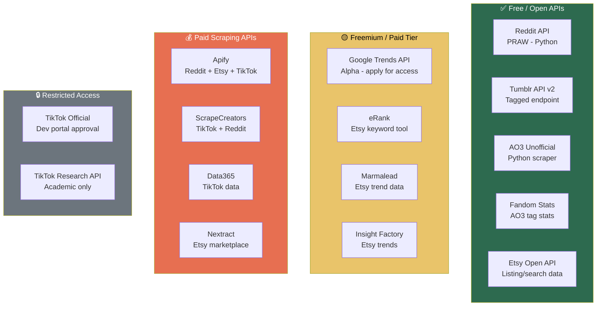
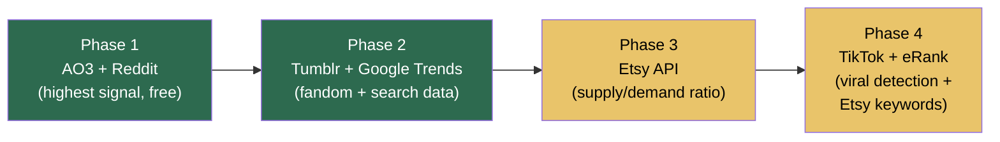

# Trend Monitoring: APIs & Data Sources Reference

## API Availability Overview

---

## Tier 1: Free & Open — Build OpenClaw Skills Around These First

### Reddit API (via PRAW)
- **What it gives you:** Subreddit posts, comments, upvotes, engagement metrics, rising posts, search
- **Access:** Free with OAuth registration. 60 requests/minute
- **Python library:** `PRAW` (official wrapper) — mature, well-documented
- **JS library:** `snoowrap` (Node.js wrapper)
- **Best for:** Monitoring fandom subreddits, detecting rising posts, analyzing comment frequency for specific quotes/references, finding "where can I buy" posts
- **Limitations:** Rate-limited to 60 req/min. Reddit's API pricing has gotten more restrictive — free tier is fine for your scale but enterprise access costs more
- **OpenClaw skill:** Poll target subreddits every 6 hours, track post velocity, extract frequently quoted phrases from top comments

### Tumblr API v2
- **What it gives you:** Posts by tag (reverse chronological), blog info, post metadata including notes count
- **Access:** Free with API key (OAuth consumer key). Register at tumblr.com/oauth/apps
- **Endpoint:** `GET /v2/tagged?tag={tag}&api_key={key}` — returns recent posts for any tag
- **Best for:** Monitoring fandom tag activity, tracking "I wish someone would make..." posts, measuring reblog/note velocity on fandom content
- **Limitations:** No built-in "trending" endpoint — you need to track note counts over time yourself to detect acceleration. Rate limits apply.
- **OpenClaw skill:** Query fandom tags every 12 hours, track note velocity over time, flag tags where engagement is accelerating

### AO3 Unofficial Python API (`ao3-api` / `ao3`)
- **What it gives you:** Work search by fandom, tag stats (total works, kudos, bookmarks), relationship tags, freeform tags, character tags
- **Access:** Free, unofficial scraper. No API key needed for public data. Account needed for restricted works.
- **Python libraries:**
  - `ao3-api` by wendytg (pip install ao3-api) — 9 modules: works, search, users, series, etc.
  - `ao3` by alexwlchan (pip install ao3) — simpler, focused on work lookup
- **Best for:** Tracking fandom growth (new works/month), identifying top ship names, extracting popular freeform tags that indicate cultural tokens
- **Limitations:** Unofficial scraping, fragile if AO3 changes HTML. Rate limiting recommended to be respectful. No official API exists yet (it's been on AO3's roadmap for years).
- **OpenClaw skill:** Every 12 hours, query target fandoms + scan for new breakout fandoms crossing 500 works/month. Track growth rates week-over-week. Extract top relationship tags and freeform tags as product candidate inputs.

### Fandom Stats API (fandomstats.org)
- **What it gives you:** AO3 tag statistics — work counts, growth data for any AO3 tag type
- **Access:** Free, REST API. `http://fandomstats.org/api/v1.0/stats?tag_id={TAG}`
- **Best for:** Quick lookups of AO3 tag growth without scraping AO3 directly. Supports multiple tags per request.
- **Limitations:** Intended for personal/academic use. May not have real-time data. Good complement to direct AO3 scraping.
- **OpenClaw skill:** Use for batch-checking tag stats across many fandoms. Cheaper than scraping AO3 directly for high-level metrics.

### Etsy Open API (v3)
- **What it gives you:** Listing search, shop data, listing details, reviews, tags
- **Access:** Free with API key. Register at etsy.com/developers
- **Best for:** Counting competitor listings for a given search term (supply side of demand/supply ratio), pulling review text for cultural token extraction, monitoring listing counts over time for saturation detection
- **Limitations:** Rate-limited. Etsy's API pricing changed in 2025 — some endpoints are more restricted. No direct "trending searches" endpoint. Autocomplete scraping is technically possible but not officially supported.
- **OpenClaw skill:** For each niche candidate, search Etsy and count listings. Pull top listings by review count. Parse review text for emotional keywords and product-specific references.

---

## Tier 2: Freemium Tools — Worth Paying For

### Google Trends API (Official Alpha)
- **What it gives you:** Search interest data over time, consistently scaled (not 0-100 per query), daily/weekly/monthly aggregation, geographic breakdown
- **Access:** Alpha testing since July 2025. Apply at developers.google.com/search/apis/trends. Rolling access — worth applying now.
- **Best for:** Tracking search interest velocity for identified topics. Detecting breakout terms. Cross-referencing cultural signals with actual search behavior.
- **Limitations:** Alpha access is limited. Until you get access, alternatives exist:
  - **pytrends** (unofficial Python library) — works but gets blocked at scale
  - **Apify Google Trends scraper** — paid, more reliable
  - **ScrapingBee** — paid scraping proxy
- **OpenClaw skill:** If you get alpha access, this becomes a primary signal source. Monitor breakout terms, track velocity, set alerts for terms crossing growth thresholds.

### eRank
- **What it gives you:** Top 100 trending Etsy keywords (daily), 15-month historical search data, keyword competition scores, competitor listing analysis
- **Access:** Free tier available (limited). Pro plan ~$10/month for full access.
- **No public API** — web-based tool. Would need scraping or manual review.
- **Best for:** Etsy-specific trend data. Trend Buzz tool shows breakout keywords with flame icons. Monthly Trends shows category-level keyword performance.
- **OpenClaw skill:** No API, so either scrape the eRank dashboard or use it as a manual weekly input to supplement automated scanning. The Chrome extension works on Etsy directly.

### Marmalead
- **What it gives you:** Etsy keyword search volume, engagement data, trending keywords refreshed hourly
- **Access:** Subscription-based. Free trial available.
- **No public API** — web-based tool.
- **Best for:** Real-time Etsy keyword trends with hourly refresh. More granular than eRank for fast-moving trends.
- **OpenClaw skill:** Same as eRank — no API, manual or scraping integration.

### Insight Factory
- **What it gives you:** Etsy trending searches with competition levels, low-competition keyword discovery, product category trends
- **Access:** Subscription-based.
- **Best for:** Finding low-competition niches — exactly what you need for identifying underserved fandoms on Etsy.

---

## Tier 3: Paid Scraping APIs — For When Free Isn't Enough

### Apify
- **What it gives you:** Scrapers for Reddit, Etsy, TikTok, Google Trends, and many more. Pre-built "Actors" you can run on schedule.
- **Access:** Free tier (limited). Paid plans start ~$49/month.
- **Specific actors:**
  - Reddit Trends Scraper — trending posts, engagement metrics
  - Etsy Seller Info Scraper — listings, reviews, shop data
  - Google Trends Scraper — alternative to official API
  - TikTok scrapers available
- **Best for:** One platform for multiple data sources. REST API for all actors. Good for OpenClaw integration since everything has a consistent API interface.
- **OpenClaw skill:** Use Apify as a unified data layer. Schedule actors to run on cron, pipe results into OpenClaw's memory for analysis.

### ScrapeCreators
- **What it gives you:** TikTok profiles, videos, trending feed, popular hashtags, popular songs. Reddit posts and comments.
- **Access:** Credit-based pricing. No subscription.
- **Best for:** TikTok trend monitoring without going through TikTok's approval process. Get trending hashtags and sounds.

### Unofficial TikTok API (Python)
- **What it gives you:** Trending videos, user info, hashtag data, search results
- **Access:** Free, open source (github.com/davidteather/TikTok-Api). Requires browser cookies for auth.
- **Best for:** Getting trending videos/hashtags without paid services
- **Limitations:** Fragile — TikTok changes frequently. May need proxies. Not officially supported.

---

## Tier 4: Restricted Access — Apply But Don't Depend On

### TikTok Official Developer Portal
- **What it gives you:** Hashtag Analytics API, Trending Content API, search
- **Access:** Requires developer account, app registration, and approval. Not guaranteed.
- **Best for:** If approved, most reliable TikTok trend data. Hashtag analytics and trending content endpoints are exactly what you need.
- **Limitations:** Approval process is slow and selective. May require business justification.

### TikTok Research API
- **What it gives you:** Public data access for academic research
- **Access:** Academic researchers at non-profit universities in US/Europe only. Not applicable for commercial use.

---

## Recommended Stack for OpenClaw

Based on cost, reliability, and relevance to your use case:

| Priority | Source | Method | Cost | Signal Type |
|----------|--------|--------|------|-------------|
| 1 | **AO3** | `ao3-api` Python + Fandom Stats API | Free | Fandom growth, cultural tokens |
| 2 | **Reddit** | PRAW | Free | Community engagement, "where to buy" posts, quote frequency |
| 3 | **Tumblr** | API v2 | Free | Fandom intensity, fan art volume, merch wishlists |
| 4 | **Google Trends** | pytrends (now) → official API (when available) | Free / apply | Search interest velocity, breakout detection |
| 5 | **Etsy** | Open API v3 | Free | Supply-side data: listing counts, reviews, saturation |
| 6 | **TikTok** | Unofficial Python API or ScrapeCreators | Free / credits | Viral content, trending hashtags and sounds |
| 7 | **eRank / Marmalead** | Manual or scrape | $0-10/mo | Etsy keyword demand data |
| 8 | **Apify** | REST API | $49/mo | Unified backup for all sources if free options break |

### Implementation order for OpenClaw skills

Start with AO3 + Reddit (free, highest signal value for your use case), then layer on additional sources as you validate the process works.

---

## API Keys & Rate Limits Summary

| API | Auth Method | Rate Limit | Notes |
|-----|------------|------------|-------|
| Reddit (PRAW) | OAuth2 | 60 req/min | Register app at reddit.com/prefs/apps |
| Tumblr v2 | OAuth1 / API key | Varies | Register at tumblr.com/oauth/apps |
| AO3 (unofficial) | None / account login | Be respectful (~1 req/sec) | No official API — scraping |
| Fandom Stats | None | Personal/academic use | fandomstats.org |
| Etsy v3 | API key | Varies by endpoint | Register at etsy.com/developers |
| Google Trends | OAuth2 (alpha) | TBD | Apply at developers.google.com |
| TikTok (unofficial) | Browser cookies | Varies | Proxy recommended |
| Apify | API token | Plan-dependent | apify.com |
