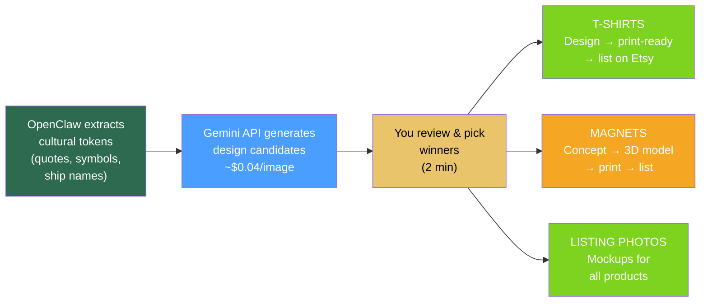
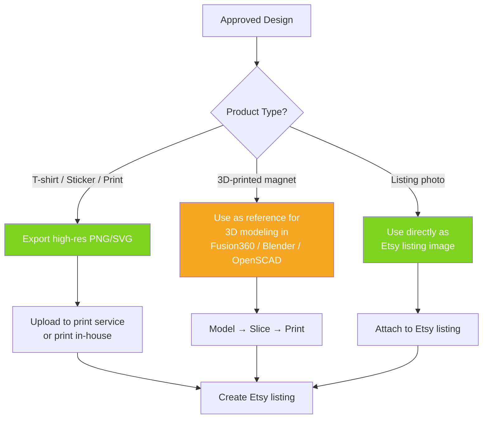
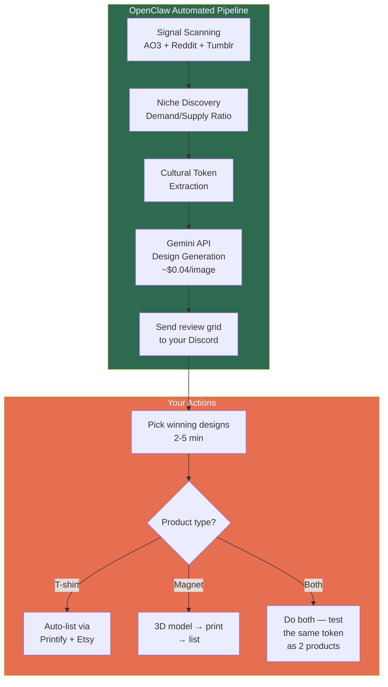

# Automated Design Generation with Nano Banana

## Where AI Image Gen Fits in the Pipeline



---

## What Nano Banana Can Automate Per Product Type

| Product | Design Generation | Listing Photos | Fully Automated? |
|---------|------------------|----------------|-----------------|
| **T-shirts (text/quote based)** | ✅ Generate print-ready designs with text, typography, layouts | ✅ Generate mockups of shirts with designs | Almost — you review, then send to print |
| **T-shirts (graphic/illustrative)** | ✅ Generate art/illustrations for fandom themes | ✅ Mockups | Almost — may need minor cleanup |
| **3D-printed magnets (text)** | 🟡 Generate 2D design reference → you model in 3D | ✅ Generate lifestyle mockup photos | Semi — 3D modeling still manual |
| **3D-printed magnets (sculptural)** | 🟡 Generate concept art → you sculpt/model | ✅ Mockups | Semi — 3D modeling still manual |
| **Stickers / flat products** | ✅ Directly generate print-ready designs | ✅ Mockups | Almost — export and print |

**Key takeaway:** T-shirts and flat products (stickers, prints, patches) are nearly fully automatable. 3D-printed products still need you to model the STL, but concept generation and listing photos can be automated.

---

## The Automated Design Pipeline

### Step 1: Cultural Token → Prompt Templates

OpenClaw takes the extracted cultural tokens from the niche discovery process and maps them to pre-built prompt templates.

**Example prompt templates:**

For quote-based t-shirt designs:
```
Create a t-shirt design with the text "{QUOTE}" in {STYLE} typography. 
The design should appeal to fans of {FANDOM}. Use colors: {COLORS}. 
The design should be on a transparent background, centered, suitable 
for direct-to-garment printing. No mockup — just the isolated design.
```

For fandom symbol magnets (concept art):
```
Create a flat, 2D design of a {SYMBOL} inspired by {FANDOM}. 
The design should be simple enough to 3D print as a refrigerator magnet 
approximately 3 inches wide. Use {COLORS}. Clean lines, minimal detail, 
bold shapes. Top-down view on white background.
```

For Etsy listing mockup photos:
```
A lifestyle photo of a refrigerator covered in colorful magnets. 
One magnet prominently displays "{QUOTE}" in {STYLE} lettering. 
The kitchen is modern and bright. The photo feels warm and inviting, 
like someone's real home. Shot on iPhone, natural lighting.
```

### Step 2: Batch Generation via Gemini API

OpenClaw calls the Gemini API programmatically to generate multiple design variants per cultural token.

**Recommended batch sizes:**
- Per cultural token: 4-6 design variants (different styles, colors, layouts)
- Per niche candidate brief (5-10 tokens): 20-60 images total
- Cost per niche: ~$0.80-2.40 at $0.039/image

**API call structure (Python):**
```python
import google.generativeai as genai

genai.configure(api_key="YOUR_API_KEY")

# Using Nano Banana Pro for better text rendering
model = genai.GenerativeModel("gemini-3-pro-image")  

def generate_design(quote, fandom, style, colors):
    prompt = f"""Create a t-shirt design with the text "{quote}" 
    in {style} typography. The design should appeal to fans of {fandom}. 
    Use colors: {colors}. Transparent background, centered, 
    suitable for direct-to-garment printing."""
    
    response = model.generate_content(prompt)
    return response.image  # Save to file
```

**OpenClaw cron integration:**
```
When: New product candidate brief generated (weekly)
Action: For each cultural token in the brief, generate 4-6 design variants
Output: Save to a review folder, send thumbnail grid to your Discord/Telegram
```

### Step 3: Human Review (2-5 minutes)

OpenClaw sends you a grid of generated designs via your messaging channel:

> **New designs for [Fandom Name] — 24 variants across 5 cultural tokens:**
> 
> 🎨 **"I'm Coming to the Cottage"** — 6 variants [view grid]
> 🎨 **[Ship Name] heart** — 4 variants [view grid]  
> 🎨 **Jersey #[X]** — 6 variants [view grid]
> 🎨 **[Running joke]** — 4 variants [view grid]
> 🎨 **[Character symbol]** — 4 variants [view grid]
>
> Reply with the numbers of designs to move to production.

You pick the winners. Everything else is automated.

### Step 4: Production Split



---

## Expanding Beyond Magnets: The T-Shirt Opportunity

This is worth calling out explicitly. You currently 3D print magnets and whistles, but with Nano Banana automating the design step, **t-shirts become a near-zero-effort product line** via print-on-demand:

| Aspect | 3D Printed Magnets | Print-on-Demand T-Shirts |
|--------|-------------------|-------------------------|
| Design effort | 3D modeling required | AI-generated, nearly print-ready |
| Production | Your 20 printers | Fulfilled by Printful/Printify/Gooten |
| Inventory risk | You print stock | Zero — printed when ordered |
| Etsy integration | Manual fulfillment | Auto-fulfillment via Printify/Printful Etsy integration |
| Margin | ~67% | ~30-50% (lower but zero effort) |
| Listing creation | Manual | Could be largely automated |

**The play:** For every cultural token you identify, generate both a magnet concept AND a t-shirt design. The t-shirt costs nothing to prototype (just a listing + AI design), and print-on-demand handles fulfillment. You're essentially testing twice as many products with the same amount of effort.

---

## Automating Listing Photos

This might be the highest-impact quick win. Good Etsy listing photos are the #1 driver of conversion, and Nano Banana can generate them en masse.

### Types of listing photos to auto-generate

1. **Product on white background** — clean, standard e-commerce shot
2. **Lifestyle / in-context** — product in a real-world setting (magnet on fridge, shirt being worn)
3. **Scale reference** — product next to common objects for size context
4. **Gift-styled** — product wrapped, in a gift box, being handed to someone
5. **Multi-product arrangement** — showing the full collection together

### Consistency with Nano Banana Pro

Nano Banana Pro's character consistency feature means you can generate multiple listing photos of the same product in different contexts while maintaining visual consistency — the magnet looks the same whether it's on a fridge, in a gift box, or on a desk.

### Photo generation prompt template
```
A {PHOTO_TYPE} photo of a {PRODUCT_DESCRIPTION}. 
{SCENE_DESCRIPTION}. 
The product clearly shows the text/design: "{DESIGN_TEXT}".
Photography style: {STYLE}. Natural lighting, high resolution, 
suitable for an Etsy product listing.
```

---

## Cost Model

| Activity | Volume | Cost |
|----------|--------|------|
| Design variants per niche (20-60 images) | Weekly | $0.80-2.40 |
| Listing photos per product (5 images) | Per listing | $0.20 |
| Monthly design generation (4 niches × 40 images) | Monthly | ~$6.50 |
| Monthly listing photos (20 new listings × 5 photos) | Monthly | ~$4.00 |
| **Total monthly image generation** | | **~$10-15** |

At ~$10-15/month for automated design generation and listing photography, the ROI on even one successful product pays for years of image generation.

---

## Integration with OpenClaw Pipeline



### End-to-end automation level

| Pipeline Step | Automation Level | Your Time |
|--------------|-----------------|-----------|
| Trend scanning | Fully automated | 0 min |
| Niche discovery | Fully automated | 0 min |
| Cultural token extraction | Fully automated | 0 min |
| Design generation | Fully automated | 0 min |
| Design review | **Human** | 2-5 min |
| T-shirt listing creation | Semi-automated (Printify) | 5 min |
| Magnet 3D modeling | **Human** | 30-120 min |
| Magnet printing | Automated (printer queue) | 0 min |
| Listing photography | Fully automated (AI) | 0 min |
| Listing performance monitoring | Fully automated | 0 min |
| Decay monitoring | Fully automated | 0 min |

**For t-shirts:** ~10 minutes from "trend detected" to "live on Etsy," with almost all of that being your review and final upload.

**For magnets:** The 3D modeling step is still the bottleneck, but everything before and after it is automated.
