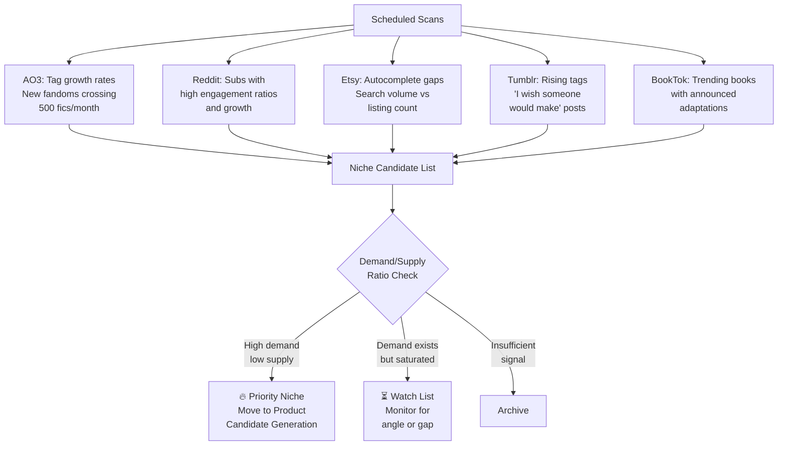
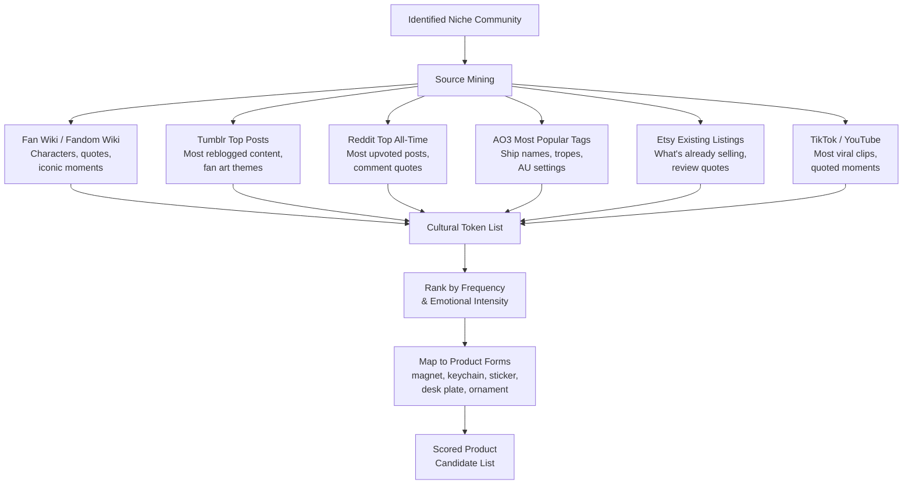
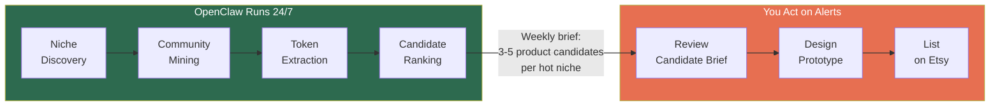

# Niche Market Discovery & Product Candidate Generation

## The Core Problem

Mainstream trend scanning catches **what's popular**. But your best opportunities are **small communities with intense emotional investment and unmet demand**. "Heated Rivalry" wasn't the biggest show on TV — it was a show with a *rabid* fandom willing to spend money on physical objects that signaled belonging.

The second problem is deeper: even once you identify a community, you don't know its **internal language**. "I'm Coming to the Cottage" means nothing to an outsider. To a Heated Rivalry fan, it's an instant buy. You need a way to extract those insider signals without personally joining every fandom.

---

## Part 1: Finding Passionate Niche Communities

### What makes a niche worth pursuing

Size doesn't matter. Intensity does. You're looking for communities that exhibit **purchasing signals**, not just engagement.

| Signal | What it means | Where to find it |
|--------|--------------|------------------|
| Fan merch already exists (fan-made) | Community *wants* physical goods | Etsy, Redbubble, Teepublic search |
| "Where can I buy..." posts | Unmet demand, people actively looking | Reddit, Tumblr, Discord, Facebook groups |
| Fan art volume is high | Visual culture = translates well to physical products | Tumblr, AO3 tags, Instagram, Pinterest |
| People use quotes as identity markers | In-joke culture = merch opportunity | Twitter/X bios, Tumblr tags, Discord statuses |
| Gift exchange culture | Bulk purchasing behavior | Reddit gift exchanges, Tumblr secret santa posts |
| Cosplay / event attendance | Willing to spend on fandom expression | Instagram, TikTok, convention tags |

### Sources ranked by niche discovery value

**Tier 1 — Best early indicators of passionate niches:**

- **AO3 (Archive of Our Own)** — Fanfiction tag growth is one of the strongest leading indicators of fandom purchasing behavior. A fandom generating 500+ new fics/month has an active, creative, *spending* community. This is where Heated Rivalry lived before it was a show.
- **Tumblr trending tags** — Tumblr's culture is heavily merch-oriented. Fans reblog fan art, create gift guides, and explicitly post "I wish someone would make..." content.
- **Reddit niche subs with high engagement ratios** — A 15K-member sub where every post gets 200+ comments is more valuable than a 500K sub with low engagement. Look at comments-per-post and subscriber growth rate.
- **Etsy search autocomplete** — Type a fandom name into Etsy search and see what autocompletes. If Etsy is already suggesting product-specific terms, there's proven demand. If there's *nothing*, you might be first.

**Tier 2 — Confirmation and depth:**

- **Discord server size + activity** — Servers with 1K+ active daily users indicate sustained engagement, not just a spike.
- **BookTok / TV adaptation pipelines** — Books with massive TikTok followings that have announced adaptations. The fandom exists and will explode when the show drops. This is your "Heated Rivalry before the show aired" opportunity.
- **Podcast fandoms** — Underserved market. Audio dramas and actual-play podcasts (like Critical Role) have intense fandoms and very little physical merch.
- **Indie game communities** — Games like Hades, Hollow Knight, Stardew Valley, Celeste have passionate fanbases that buy merch aggressively.

**Tier 3 — Cause and identity communities:**

- **Activist and identity communities** — Not just political movements but sub-communities within them. Specific orgs, specific campaigns, specific symbols that insiders recognize.
- **Professional identity communities** — Teachers, nurses, librarians, social workers — people who strongly identify with their profession and buy "identity merch."
- **Hobby subcultures** — Specific board game communities, plant parent culture, specific dog breeds, birdwatching niches. Small but passionate and recurring.

### OpenClaw automation for niche discovery

### The key metric: Demand/Supply Ratio

For each niche, OpenClaw should calculate:

- **Demand signals**: AO3 works count and growth rate (primary fandom indicator), search volume, social mentions, community size × engagement rate, "where can I buy" post frequency
- **Supply signals**: Number of Etsy listings, Redbubble designs, Amazon results
- **Ratio**: High demand ÷ low supply = opportunity

A fandom generating 500+ AO3 fics/month with only 20 Etsy listings is a prime target. A fandom with 5M casual fans and 10,000 listings is a bloodbath.

---

## Part 2: Generating Product Candidates Within a Niche

This is where the "I'm Coming to the Cottage" problem lives. Once you've identified a community, you need to extract the **specific cultural artifacts** that would make compelling products — without being a member yourself.

### What you're extracting

Every passionate community has a set of **cultural tokens** — quotes, symbols, in-jokes, character pairings, iconic moments — that function as identity markers. These are your product candidates.

| Cultural Token Type | Example (Heated Rivalry) | Product Form |
|-------------------|--------------------------|--------------|
| Iconic quotes | "I'm Coming to the Cottage" | Magnet, sticker, print |
| Character symbols | Jersey numbers, team logos | Magnet, keychain, ornament |
| Ship names / pairings | The main pairing name | Heart-shaped magnets, pair sets |
| Iconic scenes | The cottage, the rivalry moments | Diorama, scene magnets |
| Fan-created terms | Fandom-specific slang or nicknames | Stickers, pins, desk plates |
| Color associations | Team colors, character palettes | Multicolor prints (AMS advantage) |
| Running jokes | Community in-jokes | Novelty items |

### The extraction process

### Source-by-source extraction guide

**1. Fan Wikis (Fandom Wiki, dedicated wikis)**
- Best for: Character names, relationships, iconic quotes, episode summaries
- What to extract: "Quotes" sections of character pages, "Memorable moments" lists, relationship page names
- OpenClaw skill: Fetch wiki pages for the franchise, parse quote sections and character relationship pages
- API: Web scraping (wikis are public HTML). MediaWiki API for Fandom wikis.

**2. Tumblr tag analysis**
- Best for: What fans are *emotionally* attached to, which moments get art, what phrases get repeated
- What to extract: Most-reblogged posts in the fandom tag, recurring themes in fan art, text posts with 1K+ notes
- OpenClaw skill: Search fandom tags, rank content by engagement, extract recurring phrases and themes
- API: **Tumblr API v2** — `GET /v2/tagged?tag={fandom_name}` returns recent posts with note counts. Free with API key.

**3. Reddit top posts + comments**
- Best for: Community consensus on "the best moments," popular opinion on characters, quotes that get repeated in comments
- What to extract: Top all-time posts in the fandom sub, most-awarded comments, recurring phrases in comment threads
- OpenClaw skill: Fetch top posts from the fandom subreddit, analyze comment text for frequently quoted phrases
- API: **PRAW** (Python Reddit API Wrapper). Free, 60 req/min. `subreddit.top("all")` for top posts, `.comments` for extracting quoted phrases.

**4. AO3 tag data**
- Best for: Ship names (which are product names), popular tropes, AU settings that indicate what fans fantasize about
- What to extract: Top tags by work count, most bookmarked works (their tags reveal what resonates)
- OpenClaw skill: Search AO3 for the fandom, extract top relationship tags, top freeform tags
- API: **`ao3-api`** Python package (unofficial). `AO3.Search` class for fandom search. **Fandom Stats API** (`fandomstats.org`) for quick tag-level stats.

**5. Etsy existing listings + reviews**
- Best for: Proven demand, what people are already buying and what they say about it
- What to extract: Best-selling listings (sort by reviews), review text ("I bought this because...", "my friend loved the reference to..."), search autocomplete terms
- OpenClaw skill: Search Etsy for fandom name, extract top listings by review count, parse review text for emotional keywords
- API: **Etsy Open API v3** (free with key). `/v3/application/listings/active` for search, review endpoints for text extraction.

**6. TikTok / YouTube**
- Best for: Which specific scenes or quotes went viral, sound bites that became memes
- What to extract: Most-viewed fandom clips, comments sections for repeated quotes, duet/stitch themes
- OpenClaw skill: Search for fandom-specific content, identify most-engaged clips
- API: **Unofficial TikTok Python API** (free, github.com/davidteather/TikTok-Api) for trending/search. **ScrapeCreators** (credit-based) for hashtag analytics. YouTube Data API v3 (free with key) for video search and comment extraction.

### Ranking candidates

Once you have a list of cultural tokens, rank them on:

| Criterion | Weight | How to measure |
|-----------|--------|----------------|
| **Frequency** — How often does this token appear across sources? | High | Count mentions across platforms |
| **Emotional intensity** — Does it provoke joy, pride, belonging, humor? | High | Sentiment analysis, engagement ratios |
| **Visual potential** — Can this become a compelling physical object? | High | Your judgment (text-only quotes are harder than symbols) |
| **Uniqueness** — Is this specific to the fandom (insider signal) or generic? | Medium | If a non-fan would understand it, it's too generic |
| **Etsy gap** — Is anyone already selling this specific item? | Medium | Etsy search |
| **Printability** — Can your setup produce this well? Is there an AMS advantage? | Medium | Your judgment based on design complexity |

### Output format

OpenClaw delivers a **product candidate brief** per niche:

> **Niche: [Fandom/Community Name]**
> **Community size estimate:** ~45K active across platforms
> **Demand/supply ratio:** High (strong engagement, only 23 Etsy listings)
>
> **Top product candidates:**
>
> 1. **"I'm Coming to the Cottage"** — Quote appears in 340+ Tumblr posts, 28 Reddit comments in top threads. Only 2 Etsy listings with this quote. Magnet or desk plate format. High insider recognition.
> 2. **[Ship name] heart set** — The ship name is the #1 AO3 tag with 12K works. Pair of magnets in team colors = AMS advantage. 0 existing Etsy listings as magnets.
> 3. **Jersey #[X] mini** — Character's jersey number referenced in 89% of fan art. Miniature jersey magnet, multicolor. 4 existing listings but all stickers, no 3D.
> 4. **[Running joke reference]** — Inside joke from Episode 7, quoted in 200+ Reddit comments. Text-based magnet. Very high insider recognition — fans would buy this as a signal to other fans.

---

## Putting It All Together

### Weekly delivery

Every week, OpenClaw delivers:

1. **Niche radar** — New communities crossing your thresholds, with demand/supply ratios
2. **Product candidate briefs** — For your top 1-2 niches, a scored list of 5-10 specific product ideas with the cultural context explaining *why* fans would buy them
3. **Fast-mover alerts** — Any niche where velocity is extreme and you should act within days, not weeks

### Your weekly effort

- **Read the brief:** 10 minutes
- **Pick 2-3 candidates to prototype:** 5 minutes
- **Design and print:** 2-4 hours
- **List on Etsy:** 30 minutes

You go from "I have no idea what Heated Rivalry fans want" to "here are the 5 most referenced cultural tokens in this fandom, ranked by frequency and emotional intensity, with Etsy gap analysis" — without ever watching the show.
