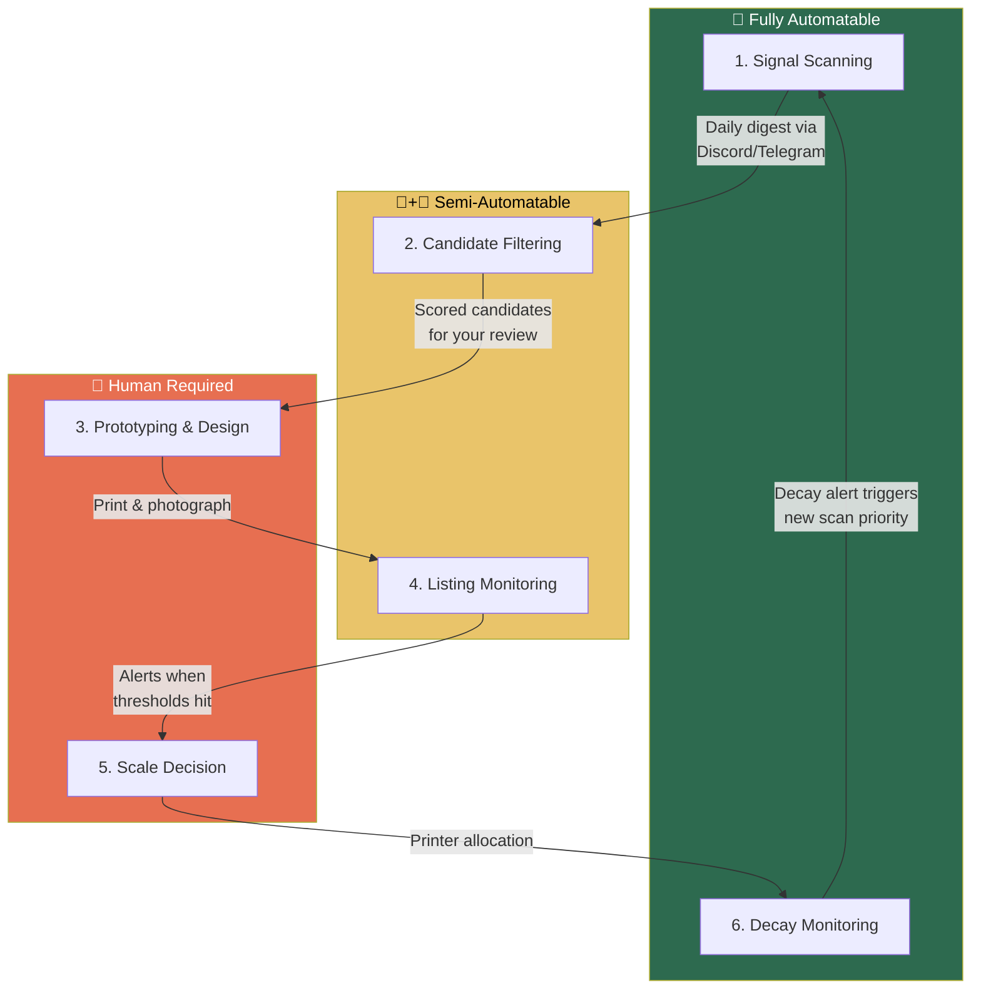
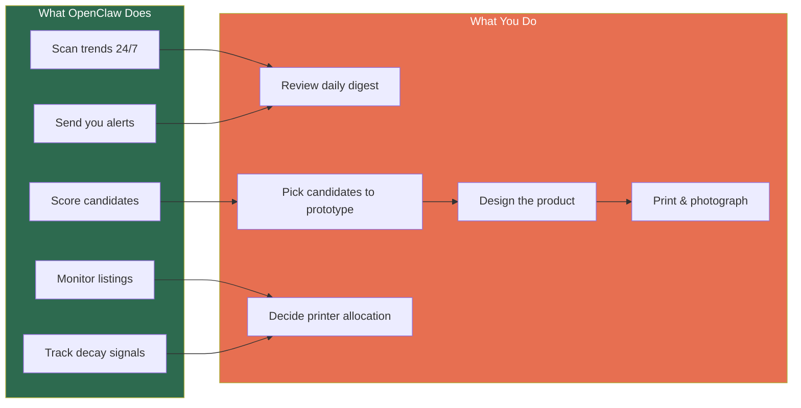

# OpenClaw Automation for Product Discovery

## Automation Map



---

## Step 1 — Signal Scanning (Fully Automatable)

This is the biggest win. OpenClaw's cron jobs and persistent memory make it ideal for continuous trend monitoring that would otherwise eat 20+ minutes of your day.

### What to automate

| Task | OpenClaw Implementation | API/Tool |
|------|------------------------|----------|
| **AO3 fanfiction tag growth** | **Highest-priority signal.** Scheduled skill that tracks fandom tags on AO3: total works, new works/month, growth rate, new relationship tags appearing. Flags any fandom crossing 500 new works/month or showing >20% week-over-week growth. Cross-references against Etsy listing count to calculate demand/supply ratio. This is your earliest indicator of a community ready to buy merch. | `ao3-api` (Python) + Fandom Stats API (`fandomstats.org/api/v1.0/stats`) |
| Google Trends monitoring | Scheduled skill that checks trending breakout terms in entertainment, politics, social movements. Runs every 6-12 hours. | `pytrends` (free, unofficial) → Google Trends API alpha (apply at developers.google.com) |
| Reddit rising posts | Skill that polls Reddit API for rising posts in target subs (r/trending, r/television, fandom subs, r/politics, r/activism). Filters by velocity and engagement. Scans comments for "where can I buy" and frequently quoted phrases. | `PRAW` (Python, free, 60 req/min) |
| Tumblr fandom tags | Skill that monitors fandom tags for rising note counts, fan art volume, and "I wish someone would make..." posts. Tracks engagement velocity over time. | Tumblr API v2 Tagged endpoint (free with API key) |
| Etsy trending searches + saturation | Skill that monitors Etsy for emerging search terms and counts competitor listings per niche. Calculates supply side of demand/supply ratio. | Etsy Open API v3 (free) + eRank/Marmalead (manual supplement, ~$10/mo) |
| TikTok/social trend detection | Skill that monitors trending hashtags and sounds. Flags anything crossing a growth-rate threshold. | Unofficial TikTok Python API (free) or ScrapeCreators (credit-based) |
| BookTok / adaptation pipeline | Skill that watches for announced TV/film adaptations of trending books. Cross-references with Goodreads and AO3 activity. | Web search + AO3 cross-reference |
| News / political flashpoints | Skill that monitors news feeds for protest-triggering events (court decisions, policy changes, elections). | RSS feeds + web search |

### How it delivers to you

OpenClaw sends you a **daily digest** to your preferred channel (Discord, Telegram, WhatsApp — wherever you already check). The digest contains:

- New signals spotted, sorted by estimated momentum
- **AO3 fandom movers** — fandoms with the highest growth rate this week, with demand/supply ratio vs Etsy
- Signals from previous days that are accelerating
- Any signal that crossed a "hot" threshold overnight

**Key advantage:** OpenClaw's persistent memory means it tracks signal *velocity* over days and weeks — it remembers what it saw yesterday and can tell you "this topic grew 3x in 48 hours" without you maintaining a spreadsheet.

### Example cron schedule

```
Every 6 hours:  Scan Google Trends, Reddit, Etsy trending
Every 12 hours: Scan TikTok trends, BookTok, adaptation news
Every 12 hours: AO3 fandom tag scrape — new works count, growth rate, new tags
Every 24 hours: Compile daily digest + velocity calculations + AO3 demand/supply ratios
Weekly:         Summarize top 5 accelerating signals + top 10 AO3 fandom movers
```

---

## Step 2 — Candidate Filtering (Semi-Automatable)

OpenClaw can do the *first pass* scoring automatically, but you'll want to make the final call.

### What to automate

| Task | OpenClaw Implementation |
|------|------------------------|
| Apply scorecard | Auto-score signals on measurable criteria: momentum (Google Trends data), Etsy saturation (search result count), velocity (rate of change). |
| Etsy competition check | For each signal, search Etsy for existing listings and count results. Flag saturation level. |
| Printability estimate | Based on the *type* of object likely needed (magnet, keychain, figurine, sheet-printable item), estimate complexity from your historical data. |
| Pre-scored candidate list | Deliver a ranked list with scores and reasoning for your review. |

### What stays human

- **Emotional intensity judgment** — Is this an identity thing or just a passing interest? OpenClaw can surface the data (Reddit comment sentiment, engagement ratios) but you'll read the vibe better.
- **Design feasibility** — Can you actually make something compelling for this trend? Only you know your design capabilities.
- **Final go/no-go** — OpenClaw presents scored candidates; you pick which ones to prototype.

### Delivery format

A weekly message like:

> **3 candidates scored 18+ this week:**
>
> 1. **[Trending show name]** — Score: 22/26. Fandom exploding on Tumblr (+400% 7d), only 12 Etsy listings, magnet/keychain-shaped opportunity, multicolor advantage likely.
> 2. **[Political event]** — Score: 20/26. Rally scheduled in 3 cities next month, bulk-purchase pattern likely, sheet-printable symbol possible.
> 3. **[Viral meme]** — Score: 18/26. Peaking fast — if you move this week. 340 Etsy listings already but mostly low quality.

---

## Step 4 — Listing Performance Monitoring (Semi-Automatable)

Once a listing is live, OpenClaw can watch the numbers for you instead of you checking Etsy seller dashboard daily.

### What to automate

| Task | OpenClaw Implementation |
|------|------------------------|
| Daily metrics pull | Skill that checks Etsy seller dashboard or API for views, favorites, conversion rate per listing. |
| Threshold alerts | Notify you immediately when a listing crosses key thresholds (first sale, fav/view > 5%, views > 100). |
| Traction classification | Auto-classify each listing: "scaling candidate," "needs optimization," or "no signal — leave and move on." |
| Competitor watch | For active listings, periodically check if competitor count is growing. |

### Alert examples

> **🔥 SCALE SIGNAL:** "Heated Rivalry Magnet v2" got 3 organic sales in 48 hours. Fav/view ratio: 12%. Recommend allocating printers.

> **📊 Weekly listing report:** 4 active test listings. 1 showing traction, 2 no signal (leaving up), 1 needs photo improvement (low fav/view despite 200+ views).

---

## Step 6 — Decay Monitoring (Fully Automatable)

This is the other big win. OpenClaw can watch for the plateau so you don't get caught holding capacity on a dying trend.

### What to automate

| Task | OpenClaw Implementation |
|------|------------------------|
| Sales trend tracking | Monitor weekly sales per product. Flag two consecutive weeks of decline. |
| Google Trends decay | Track core keywords for active products. Alert on sustained downward trajectory. |
| Etsy saturation growth | Count competitor listings weekly. Alert when count doubles from your baseline. |
| Cultural signal death | Monitor for "end of wave" events: season finale, movement achieving its goal, meme dying on social. |

### Alert example

> **⚠️ DECAY WARNING — Whistles:** Sales down 18% two weeks running. Google Trends for "[keyword]" dropped 30% from peak. Competitor listings up from 45 to 112. Recommend reducing printer allocation from 8 to 3 and accelerating next product test.

---

## What Stays Human



The physical loop — designing, printing, photographing — stays with you. Everything informational becomes background infrastructure that runs 24/7 and talks to you through your messaging app.

---

## Estimated Time Savings

| Activity | Without OpenClaw | With OpenClaw |
|----------|-----------------|---------------|
| Daily signal scanning | 20 min/day | 2 min (read digest) |
| Weekly candidate scoring | 30 min | 5 min (review pre-scored list) |
| Listing performance checks | 15 min/day | 0 (alert-driven) |
| Decay monitoring | 15 min/week | 0 (alert-driven) |
| **Weekly total** | ~4-5 hours | ~30 min |

Your time shifts almost entirely to the creative and physical work — design, prototyping, photography — which is where your human judgment actually matters.

---

## Implementation Priority

If you're setting this up, start with the highest-value automations first:

1. **Signal scanning cron jobs** — This is the core engine. Get this running first.
2. **Decay monitoring for current products** — Protect your existing revenue.
3. **Listing performance alerts** — Catch scale signals faster.
4. **Candidate pre-scoring** — Nice-to-have refinement once scanning is solid.
