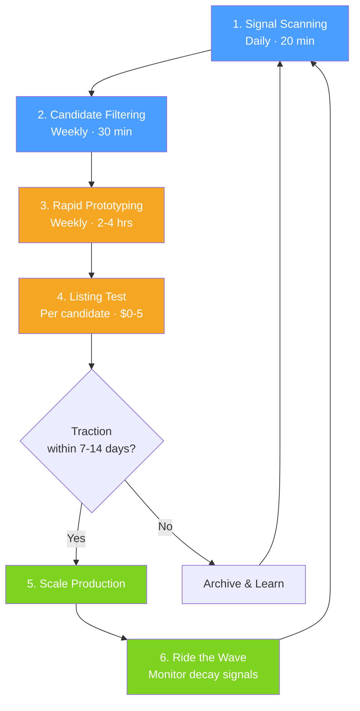
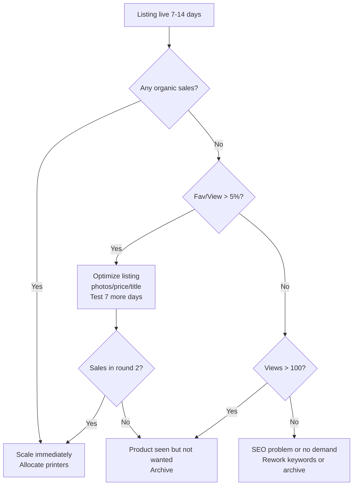

# 3D Print Product Discovery Process

## Why Your Hits Were Hits

Before building the process, it's worth naming the pattern. Both your successes share five traits:

| Trait | Whistles | Magnets |
|-------|----------|---------|
| Cultural wave | Activist movement | Viral TV series |
| Emotional charge | Identity / resistance | Fandom / belonging |
| Giftable / shareable | Handed out at events | Gifted between fans |
| Fast to print | 200/printer/8hr | 15/printer/6hr |
| Strong unit economics | ~67% margin | ~67% margin |

The product you're looking for next will likely check most of these boxes. The process below is designed to surface candidates that fit this profile, then validate them cheaply before you commit production capacity.

---

## The Process

---

## Step 1 — Signal Scanning (Daily, 20 min)

The goal is to spot cultural waves **early**, before Etsy is saturated. You're not looking for product ideas directly — you're looking for **movements, moments, and fandoms gaining momentum**.

### Sources to monitor

**Trending culture:**
- TikTok trending sounds/hashtags (this is where both your hits likely showed early signal)
- Google Trends — set alerts for breakout terms in entertainment, politics, social movements
- Reddit rising posts in r/trending, r/politics, r/television, fandom subs
- Twitter/X trending topics and viral threads

**Fandom-specific:**
- **AO3 fanfiction tag growth** — This is your single best leading indicator. Track fandoms crossing 500+ new works/month or showing rapid tag growth. A fandom generating hundreds of fics has a creative, emotionally invested community that *will* buy merch. "Heated Rivalry" almost certainly showed up here long before the show went viral. Monitor: total works per fandom tag over time, new relationship/character tags appearing, growth rate week-over-week.
- Tumblr trending tags — Fan communities signal months before mainstream here. Watch for rising reblog counts and "I wish someone would make..." posts.
- Discord servers for active fandoms
- Goodreads trending / BookTok for upcoming adaptations

**Activist/cause-driven:**
- Protest calendar sites, activist Twitter accounts
- News about policy changes that trigger grassroots response
- Nonprofit campaigns launching

**Etsy competitive intel:**
- eRank or Marmalead trending searches
- Browse Etsy's "trending now" and "popular right now" sections
- Search for "3D printed" + trending topic to gauge saturation

### What you're writing down

Keep a simple log (spreadsheet or Notion). For each signal, capture:

- **What's trending** — the show, movement, event
- **Who cares** — the community, their size, their intensity
- **Emotional driver** — fandom love, outrage, identity, humor, nostalgia
- **Velocity** — is it accelerating or peaking?
- **AO3 signal** (if fandom) — total works, works added this month, top relationship tags, growth rate

---

## Step 2 — Candidate Filtering (Weekly, 30 min)

Review your signal log and run each through a **scorecard**. Only prototype items scoring 7+.

| Criterion | Score 0-2 | Weight |
|-----------|-----------|--------|
| **Cultural momentum** — Is the wave still building, not cresting? | 0 = peaked, 2 = accelerating | ×3 |
| **Emotional intensity** — Do people *identify* with this, not just like it? | 0 = mild interest, 2 = identity/cause | ×3 |
| **Printability** — Can you make a compelling object that's small, fast, no post-processing? | 0 = complex/slow, 2 = sheet-printable | ×2 |
| **Giftability** — Would someone buy 5+ to hand out, gift, or display? | 0 = single purchase, 2 = bulk/gifting | ×2 |
| **Margin potential** — Can you hit ≥60% margin at a ≤$15 price point? | 0 = expensive materials, 2 = cheap & fast | ×2 |
| **Etsy saturation** — Are there already 500+ listings for this exact niche? | 0 = saturated, 2 = wide open | ×1 |

**Max score: 26. Prototype threshold: 18+**

### AMS advantage filter

For your 6 multicolor printers, add a bonus question: *Does color/multi-material add significant perceived value?* Magnets are a good example — multicolor makes them pop. If yes, you have a moat that single-extruder sellers can't match easily.

---

## Step 3 — Rapid Prototyping (Weekly, 2-4 hrs)

For candidates that pass filtering:

1. **Design in under 2 hours.** If it takes longer, the iteration cost is too high. Use parametric designs where possible so you can remix quickly.
2. **Print one test batch.** Evaluate print time, failure rate, and whether the physical object actually feels *good*.
3. **Photograph immediately.** Lifestyle-style photos if possible — the listing test depends on this.

### Kill criteria
Stop if any of these are true:
- Print time per unit exceeds your magnet benchmark (24 min/unit) by more than 3×
- Post-processing is needed (painting, gluing, assembly)
- The object doesn't photograph well — if it doesn't look good in a photo, it won't sell on Etsy

---

## Step 4 — Listing Test (Per candidate, $0-5)

Create the Etsy listing with strong SEO and your best photos. Optionally boost with $3-5 of Etsy ads for 7 days.

**What to measure:**
- **Views** — Is there search demand?
- **Favorites** — Are people interested enough to save?
- **Conversion** — Did anyone buy?
- **Favorite-to-view ratio** — Above 5% is promising; above 10% is strong signal

**Decision framework:**

---

## Step 5 — Scale Production

When a listing shows traction, allocate printers aggressively. Your capacity math:

| Product type | Units/printer/day | 20 printers/day | Revenue/day | Profit/day |
|-------------|-------------------|-----------------|-------------|------------|
| Whistle-like (sheet print) | 600 | 12,000 | $1,800 | $1,200 |
| Magnet-like (medium batch) | 60 | 1,200 | $9,000 | $6,000 |
| *Your capacity is the moat* | | | | |

Key decision: how many printers to reallocate from current products to the new one. Keep a minimum allocation on proven sellers while they still have demand.

---

## Step 6 — Ride the Wave & Monitor Decay

Every trending product has a lifecycle. Set decay alerts:

- **Weekly sales trend** — Two consecutive weeks of decline = start scanning for the replacement
- **Google Trends** — Set an alert for the core keyword; watch for downward trajectory
- **Etsy saturation** — When competitor listings double, your margins will compress
- **Cultural signal** — Season finale aired? Movement achieved its goal? The wave may be ending.

**Don't wait for zero.** Start reallocating printers when you see the plateau, not the cliff.

---

## Idea Categories Worth Watching Right Now

Based on the pattern of what works for your setup, here are categories that tend to produce hits with the profile you need:

1. **Book/show adaptations** — Especially BookTok-to-screen pipelines. The fandom exists before the show airs, giving you a head start. Watch for upcoming adaptations of fan-favorite series.
2. **AO3 breakout fandoms** — Fandoms showing rapid fic growth (500+ works/month or accelerating) are your earliest signal of a community ready to buy merch. Cross-reference with Etsy supply — high AO3 activity + low Etsy listings = prime opportunity. This is how you would have caught Heated Rivalry months early.
3. **Political/social flashpoints** — Election cycles, court decisions, policy rollbacks. These produce intense emotional identification and bulk purchasing (rallies, protests, group orders).
4. **Meme objects** — Physical manifestations of viral memes. Short shelf life but explosive demand. The key is speed — you need to be listed within days, not weeks.
5. **Teacher/nurse/niche-profession gifts** — Seasonal (appreciation weeks, holidays) but recurring annually. Less explosive, more predictable.
6. **Pet culture** — Pet owners buy impulsively and share on social media, creating organic marketing. Tags, toys, accessories.
7. **Nostalgia waves** — Reboots, anniversaries, "90s kids" content cycles. Predictable if you track entertainment calendars.

---

## Tooling Summary

| Need | Tool | Cost |
|------|------|------|
| Trend monitoring | Google Trends + TikTok + Reddit | Free |
| Etsy keyword research | eRank (free tier) or Marmalead | Free–$10/mo |
| Signal log | Notion or Google Sheet | Free |
| Listing analytics | Etsy seller dashboard | Free |
| Competitor monitoring | eRank or manual checks | Free |

---

## Weekly Rhythm

| Day | Activity | Time |
|-----|----------|------|
| Daily | Signal scan (TikTok, Trends, Reddit, news) | 20 min |
| Monday | Review signal log, score candidates | 30 min |
| Tuesday–Wednesday | Prototype top candidate(s) | 2-4 hrs |
| Thursday | List and photograph | 1-2 hrs |
| Friday | Review active listing performance, adjust | 30 min |

Total investment: **~6-8 hours/week** on discovery, separate from production operations.
