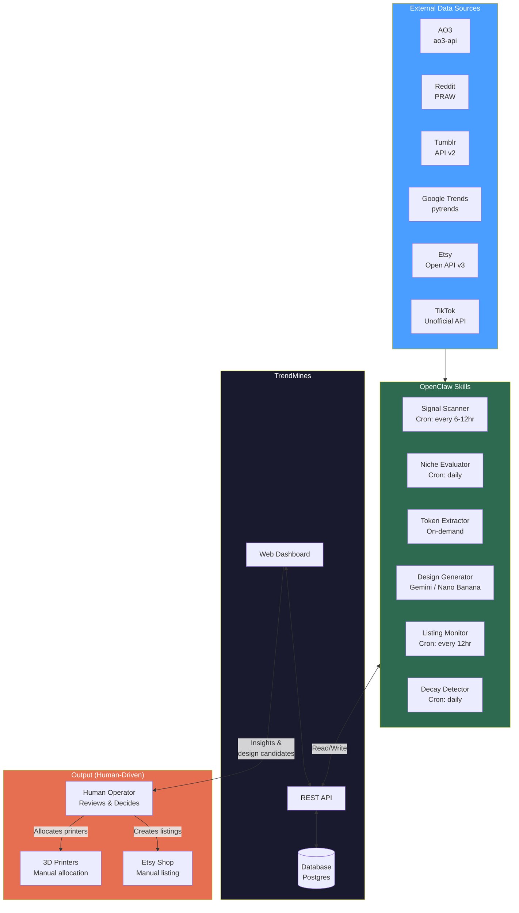
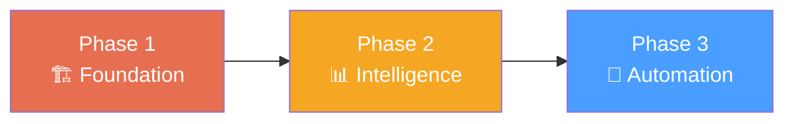

# TrendMines — System Design & Feature Set

## Overview

TrendMines is a **trend intelligence and product discovery platform** for your 3D printing business. It focuses on the insight, analysis, and design generation side — production, fulfillment, and printer management are handled externally by the operator. It has two interfaces:

1. **Web Dashboard** — Where you review signals, evaluate niches, review AI-generated designs, and monitor listing performance
2. **REST API** — What OpenClaw skills read from and write to, enabling full automation of the scanning/generation pipeline

The dashboard is your **decision-making surface** — everything automated flows into it, and your decisions (what to prototype, what to list) flow back out through it. **Production (printing, fulfillment, Etsy listing creation, Printify) is handled outside the platform.**

---

## Architecture



---

## Data Model

```mermaid
erDiagram
    SIGNAL ||--o{ NICHE : "promotes to"
    NICHE ||--o{ CULTURAL_TOKEN : "contains"
    CULTURAL_TOKEN ||--o{ DESIGN : "generates"
    DESIGN ||--o{ PRODUCT : "becomes"
    PRODUCT ||--o{ LISTING : "listed as"
    LISTING ||--o{ METRIC_SNAPSHOT : "tracked by"

    SIGNAL {
        uuid id
        string source
        string topic
        string description
        float momentum_score
        jsonb raw_data
        string status
        timestamp first_seen
        timestamp last_updated
    }

    NICHE {
        uuid id
        string name
        string description
        string community_type
        float demand_score
        float supply_score
        float demand_supply_ratio
        int ao3_works_count
        float ao3_growth_rate
        int etsy_listing_count
        string status
        timestamp discovered_at
    }

    CULTURAL_TOKEN {
        uuid id
        uuid niche_id
        string token_type
        string value
        float frequency_score
        float emotional_intensity
        float visual_potential
        float uniqueness_score
        float composite_score
        jsonb source_references
        string status
    }

    DESIGN {
        uuid id
        uuid cultural_token_id
        string prompt_used
        string image_url
        string design_type
        string style
        string status
        float generation_cost
        timestamp created_at
    }

    PRODUCT {
        uuid id
        uuid design_id
        string product_type
        string name
        float unit_cost
        float target_price
        float margin_pct
        int print_time_minutes
        int units_per_batch
        string stl_file_url
        string status
    }

    LISTING {
        uuid id
        uuid product_id
        string etsy_listing_id
        string title
        string status
        float price
        timestamp listed_at
    }

    METRIC_SNAPSHOT {
        uuid id
        uuid listing_id
        int views
        int favorites
        int sales
        float fav_view_ratio
        float revenue
        timestamp captured_at
    }

```



> **Note:** PrinterAssignment is not modeled in TrendMines. Printer allocation is managed externally by the operator.

---

## Dashboard Features

### 1. Signal Radar (Home Screen)

The first thing you see when you open the dashboard. A real-time view of what's trending across all monitored sources.

**Layout:** A feed-style view, sorted by momentum, with source badges and sparkline charts.

**Features:**
- Live signal feed with momentum scores and source badges (AO3, Reddit, Tumblr, Google Trends, TikTok)
- Sparkline charts showing velocity over the last 7/14/30 days per signal
- Quick-filter by source, by community type (fandom, activist, meme, professional)
- "Promote to Niche" action button — one click to move a signal into niche evaluation
- Signal status labels: `new` | `watching` | `promoted` | `archived`
- Daily digest view matching what OpenClaw sends to your messaging channel

**API endpoints:**
```
GET    /api/signals                    # List signals (filterable, sortable)
POST   /api/signals                    # OpenClaw writes new signals
PATCH  /api/signals/:id                # Update status, score
GET    /api/signals/:id/history        # Momentum over time
```

---

### 2. Niche Pipeline

A kanban-style board showing niches moving through your evaluation pipeline.

**Columns:** `Discovered` → `Evaluating` → `Mining Tokens` → `Generating Designs` → `Active` → `Declining` → `Archived`

**Features:**
- Drag-and-drop cards between pipeline stages
- Each niche card shows: name, demand/supply ratio gauge, AO3 work count, Etsy listing count, days since discovery
- Click into a niche to see the full evaluation scorecard, all cultural tokens extracted, and design candidates
- Automated stage transitions: OpenClaw moves niches forward as it completes each step
- Manual override: you can push a niche forward or archive it at any stage
- Color coding by community type (fandom = purple, activist = red, meme = yellow, professional = blue)

**API endpoints:**
```
GET    /api/niches                     # List all niches
POST   /api/niches                     # Create niche (from signal promotion)
PATCH  /api/niches/:id                 # Update stage, scores
GET    /api/niches/:id/tokens          # Cultural tokens for this niche
GET    /api/niches/:id/designs         # Design candidates for this niche
GET    /api/niches/:id/scorecard       # Full evaluation scorecard
```

---

### 3. Cultural Token Explorer

A searchable, sortable table of all extracted cultural tokens across all niches.

**Features:**
- Table view: token value, type (quote, symbol, ship name, joke), niche, composite score, source count, design count, product status
- Filter by niche, by token type, by score range, by status
- Click a token to see: all source references (with links), all generated designs, all derived products
- Bulk actions: "Generate designs for selected" — triggers Nano Banana batch for multiple tokens at once
- Token status labels: `extracted` | `designs_pending` | `designs_ready` | `in_production` | `listed`
- Inline score breakdown: frequency, emotional intensity, visual potential, uniqueness, Etsy gap

**API endpoints:**
```
GET    /api/tokens                     # List tokens (filterable)
POST   /api/tokens                     # OpenClaw writes extracted tokens
PATCH  /api/tokens/:id                 # Update scores, status
POST   /api/tokens/:id/generate        # Trigger design generation
GET    /api/tokens/:id/sources         # Source references
```

---

### 4. Design Review Gallery

A visual gallery of AI-generated designs awaiting your review. This is where you spend your 2-5 minutes per week.

**Features:**
- Grid view of design thumbnails, grouped by cultural token / niche
- Quick approve/reject actions (keyboard shortcuts: `a` to approve, `x` to reject, arrow keys to navigate)
- Side-by-side comparison: see 4-6 variants of the same token and pick the winner
- Design metadata: prompt used, generation cost, design type (t-shirt, magnet concept, listing photo)
- Approved designs auto-advance: t-shirt designs go to Printify queue, magnet concepts go to your modeling queue, listing photos attach to products
- Regenerate action: tweak the prompt and re-run for any design that's close but not right
- Filter by: status (`pending_review` | `approved` | `rejected` | `needs_revision`), niche, product type

**API endpoints:**
```
GET    /api/designs                    # List designs (filterable)
POST   /api/designs                    # OpenClaw writes generated designs
PATCH  /api/designs/:id                # Approve/reject/revise
POST   /api/designs/:id/regenerate     # Re-generate with modified prompt
GET    /api/designs/:id/image          # Fetch the actual image
```

---

### 5. Product Catalog

All products across all types — 3D printed magnets, whistles, t-shirts, stickers, etc.

**Features:**
- Card grid view: product image, name, type, margin, print time, status, weekly sales sparkline
- Filter by product type, status, margin range, niche
- Product detail page: linked design, STL file (for 3D prints), print settings, cost breakdown, all listings, sales history
- Status labels: `prototype` | `listed` | `scaling` | `declining` | `retired`
- Quick actions: "Create Etsy Listing" (pre-fills from product data), "Assign Printers", "Retire Product"
- Cost calculator: input material cost, print time, batch size → auto-calculates margin at various price points

**API endpoints:**
```
GET    /api/products                   # List products
POST   /api/products                   # Create product from approved design
PATCH  /api/products/:id               # Update status, pricing, settings
GET    /api/products/:id/listings      # All Etsy listings for this product
GET    /api/products/:id/metrics       # Sales and performance data
POST   /api/products/:id/list          # Create Etsy listing
```

---

### 6. Listing Performance Dashboard

Real-time and historical performance of all your Etsy listings.

**Features:**
- Summary stats at top: total active listings, total views today, total sales today, total revenue this week/month
- Listing table with columns: product name, days listed, views, favorites, sales, fav/view ratio, revenue, trend arrow
- Automatic traction classification badges: 🔥 `scaling` | 📊 `promising` | 😐 `no signal` | 📉 `declining`
- Click into any listing for detailed daily metrics chart (views, favs, sales over time)
- Alerts panel: surface listings that just hit traction thresholds (first sale, fav/view > 5%, views > 100)
- Competitor watch: for scaling listings, show how many competing Etsy listings exist and whether that count is growing

**API endpoints:**
```
GET    /api/listings                   # List all listings
POST   /api/listings                   # Create listing (OpenClaw or manual)
GET    /api/listings/:id/metrics       # Metric snapshots over time
POST   /api/listings/:id/metrics       # OpenClaw writes metric snapshots
GET    /api/listings/alerts            # Listings crossing thresholds
GET    /api/listings/leaderboard       # Top performers ranked
```

---

### 7. Decay Monitor

> **Note:** Printer Fleet Manager, capacity calculator, and production queue management are out of scope. The operator manages printers and production externally.

A dedicated view for watching your active products' lifecycles.

**Features:**
- Active products with lifecycle stage indicators: 🚀 `launching` | 📈 `growing` | 🏔️ `plateau` | 📉 `declining` | ⚠️ `urgent`
- Per-product charts: weekly sales trend, Google Trends data for related keywords, Etsy competitor count over time
- Auto-generated alerts when decay conditions are met (two consecutive weeks of sales decline, competitor count doubled, Google Trends dropping)
- Recommended actions: "Consider reducing production", "This niche may be saturated — investigate alternatives"
- Historical graveyard: retired products with post-mortem data (total revenue, lifespan, peak sales rate)

**API endpoints:**
```
GET    /api/decay                      # All products with decay signals
GET    /api/decay/:product_id          # Decay data for specific product
POST   /api/decay/:product_id/alerts   # OpenClaw writes decay alerts
GET    /api/products/graveyard         # Retired product history
```

---

### 8. Analytics & Insights

Aggregate business intelligence across the entire pipeline.

**Features:**
- Revenue dashboard: daily/weekly/monthly revenue, broken down by product and product type
- Pipeline conversion funnel: signals → niches → tokens → designs → products → listings → sales
- Hit rate tracking: what % of signals become profitable products? Which sources produce the best signals?
- Source ROI: which data source (AO3, Reddit, Tumblr, etc.) has led to the most revenue?
- Niche lifecycle analysis: average lifespan of a trending product, time from signal to first sale
- Cost tracking: API costs (Gemini, scraping), Etsy listing fees

**API endpoints:**
```
GET    /api/analytics/revenue          # Revenue by period, product, type
GET    /api/analytics/funnel           # Pipeline conversion metrics
GET    /api/analytics/sources          # Signal source ROI
GET    /api/analytics/costs            # API and material cost tracking
```

---

### 9. Settings & Configuration

**Features:**
- **Data source management:** API keys for each source, enable/disable sources, set scan frequencies
- **Scorecard weights:** Adjust the weights in your candidate scoring formula
- **Alert thresholds:** Configure when you get notified (e.g., sales decline > X%, fav/view > Y%)
- **Prompt templates:** Manage and edit the Nano Banana prompt templates for each product type
- **OpenClaw webhook URL:** Where to send notifications for your messaging channel
- **User preferences:** Dashboard theme, notification preferences, timezone

**API endpoints:**
```
GET    /api/settings                   # All configuration
PATCH  /api/settings                   # Update configuration
GET    /api/settings/api-keys          # Manage external API keys
POST   /api/settings/test-connection   # Test external service connections
```

---

## API Design Principles

### Authentication
- API key-based auth for OpenClaw skills (`X-API-Key` header)
- Session-based auth for dashboard (standard cookie/JWT)
- All endpoints return JSON

### Conventions
```
GET    /api/{resource}                 # List (supports ?status=, ?sort=, ?limit=)
POST   /api/{resource}                 # Create
GET    /api/{resource}/:id             # Read
PATCH  /api/{resource}/:id             # Update
DELETE /api/{resource}/:id             # Soft-delete (archive)

# Nested resources
GET    /api/{parent}/:id/{children}    # List children

# Actions
POST   /api/{resource}/:id/{action}   # Trigger action (generate, allocate, etc.)
```

### Pagination
```json
{
  "data": [...],
  "meta": {
    "total": 142,
    "page": 1,
    "per_page": 25,
    "total_pages": 6
  }
}
```

### Webhooks (OpenClaw → Dashboard)
OpenClaw can also receive push notifications from the dashboard:
```
POST /openclaw/webhook
{
  "event": "design_approved",
  "product_type": "magnet",
  "design_id": "uuid",
  "action": "notify_operator"
}
```

---

## OpenClaw Skill ↔ API Mapping

| OpenClaw Skill | Writes To | Reads From |
|----------------|-----------|------------|
| Signal Scanner | `POST /api/signals` | `GET /api/settings` (scan config) |
| Niche Evaluator | `PATCH /api/niches/:id` (scores) | `GET /api/signals` (promoted signals) |
| Token Extractor | `POST /api/tokens` | `GET /api/niches/:id` (niche context) |
| Design Generator | `POST /api/designs` | `GET /api/tokens` (pending tokens), `GET /api/settings` (prompt templates) |
| Listing Monitor | `POST /api/listings/:id/metrics` | `GET /api/listings` (active listings) |
| Decay Detector | `POST /api/decay/:id/alerts` | `GET /api/products` (active products), `GET /api/listings/:id/metrics` |

---

## Tech Stack Recommendation

| Layer | Technology | Rationale |
|-------|-----------|-----------|
| **Backend / API** | Ruby on Rails | Your primary language. Convention over configuration. Fast to build REST APIs with good ORM. |
| **Database** | PostgreSQL | JSONB support for flexible schema (raw signal data, source references). Strong with time-series queries for metrics. |
| **Background jobs** | Sidekiq | For async work: design generation, metric collection, data source scanning |
| **Frontend** | Hotwire (Turbo + Stimulus) or React | Hotwire keeps you in Ruby-land. React if you want richer interactivity (design gallery, drag-and-drop kanban). |
| **File storage** | S3 / Cloudflare R2 | For generated design images |
| **Hosting** | Fly.io or Railway | Easy Rails deployment. Or your own server if you prefer. |
| **Caching** | Redis | Sidekiq backend + caching layer for dashboard performance |

### Alternative: If you want faster prototyping
| Layer | Technology |
|-------|-----------|
| Backend | Python (FastAPI) — if you want to stay close to the scraping libs (PRAW, ao3-api, pytrends are all Python) |
| Frontend | React or Next.js |
| Database | PostgreSQL |

The tradeoff: Rails is your strength and gives you a polished app faster. Python keeps you in the same language as your scraping/API layer. A hybrid (Python microservice for scraping, Rails for dashboard/API) is also viable.

---

## MVP Feature Priority

Build in this order to get value fastest:



**Phase 1 — Foundation:**
- Data model + API skeleton (all resource CRUD)
- Signal Radar (read + write signals)
- Niche Pipeline (kanban board)
- OpenClaw auth + webhook integration
- Basic settings page

**Phase 2 — Intelligence:**
- Cultural Token Explorer
- Listing Performance Dashboard
- Decay Monitor
- Analytics (revenue, funnel)
- Metric snapshot collection

**Phase 3 — Automation:**
- Design Review Gallery
- Nano Banana / Gemini API integration
- Prompt template management
- Alert notification system
- Webhook integration for OpenClaw

> **Out of scope:** Printer fleet management, capacity planning, production queues, Printify integration, auto-listing creation on Etsy. TrendMines is a trend intelligence and design candidate platform — the operator handles production and fulfillment externally.
